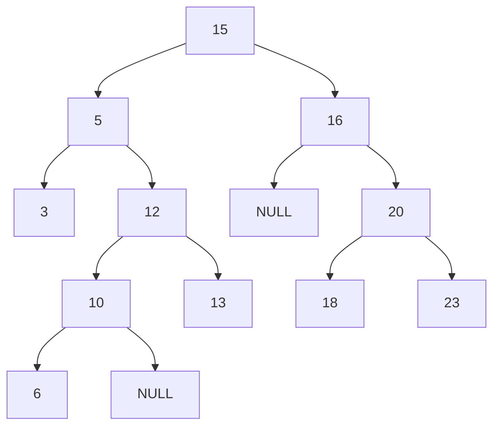

### 进制

本质：其实就是查表，按每一行到下一行进位来排列

### 逻辑运算

- 或（`or |`）：只要有1个就是1
- 与（`and &`）：两个都为1才是1
- 异或（`xor ^`）:两个不一样才是1
- 非（`not ！`）：1是0，0是1

### 汇编语言

注意：

- `[]`等价与`c`语言中的`*`，`lea`指令相当于`c`语言中的`&`

- 标志寄存器如下：

  

###### 标志寄存器

- 进位标志`CF`(`Carry Flag`)：如果运算结果的最高位产生了一个进位或借位，那么，其值为1，否则其值为0。
- 奇偶标志`PF`(`Parity Flag`)：用于反映运算结果中“1”的个数的奇偶性。如果“1”的个数为偶数，则PF的值为1，否则其值为0。（有效的部分1的个数）
- 辅助进位标志`AF`(`Auxiliary Carry Flag`)：在发生下列情况时，辅助进位标志AF的值被置为1，否则其值为0：
  1. 在字操作时，发生低字节向高字节进位或借位时；
  2. 在字节操作时，发生低4位向高4位进位或借位时。
- 零标志`ZF`(`Zero Flag`)：零标志`ZF`用来反映运算结果是否为0。如果运算结果为0，则其值为1，否则其值为0。在判断运算结果是否为0时，可使用此标志位。
- 符号标志`SF`(`Sign Flag`)：符号标志`SF`用来反映运算结果的符号位，它与运算结果的最高位相同。
- 溢出标志`OF`(`Overflow Flag`)：溢出标志`OF`用于反映有符号数加减运算所得结果是否溢出。如果运算结果超过当前运算位数所能表示的范围，则称为溢出，`OF`的值被置为1，否则，`OF`的值被清为0。

注意：

- 最高位进位与溢出的区别：

  进位标志表示无符号数运算结果是否超出范围

  溢出标志表示有符号数运算结果是否超出范围

- 溢出主要是给有符号运算使用的，在有符号的运算中，有如下的规律：

  `正 + 正 = 正` 如果结果是负数，则说明有溢出

  `负 + 负 = 负` 如果结果是正数，则说明有溢出

  `正 + 负` 永远都不会有溢出

- 有无符号：

  1. 无符号数：`0 ..... FF`
  2. 有符号数：
     - 正数：`0 ..... 7F`
     - 负数：`80 ..... FF`

###### 数据操作指令

- `ADC`指令：带进位加法

  格式：`ADC  R/M,R/M/IMM`   两边不能同时为内存  宽度要一样

- `SBB`指令：带借位减法

  格式：`SBB  R/M,R/M`   两边不能同时为内存  宽度要一样

- `XCHG`指令：交换数据

  格式：`XCHG  R/M,R/M/IMM`   两边不能同时为内存  宽度要一样

- `MOVS`指令：移动数据  内存-内存

  `MOVS`后面跟`B，W，D`代表`[EDI]`单元的大小

- `STOS`指令：将`Al/AX/EAX`的值存储到`[EDI]`指定的内存单元

  `STOS`后面跟`B，W，D`代表`[EDI]`单元的大小

- `REP`指令：按计数寄存器 `(ECX)` 中指定的次数重复执行字符串指令

###### JCC

```
1、	JE, JZ       		结果为零则跳转(相等时跳转)						ZF=1

2、	JNE, JNZ        		结果不为零则跳转(不相等时跳转)  						ZF=0

3、	JS 		结果为负则跳转						SF=1

4、	JNS 		结果为非负则跳转						SF=0

5、	JP, JPE   		结果中1的个数为偶数则跳转						PF=1

6、	JNP, JPO   		结果中1的个数为偶数则跳转						PF=0

7、	JO    		结果溢出了则跳转						OF=1

8、	JNO    		结果没有溢出则跳转						OF=0

9、	JB, JNAE   		小于则跳转 (无符号数)						CF=1

10、	JNB, JAE    		大于等于则跳转 (无符号数)						CF=0

11、	JBE, JNA    		小于等于则跳转 (无符号数)						CF=1 or ZF=1

12、	JNBE, JA    		大于则跳转(无符号数)						CF=0 and ZF=0

13、	JL, JNGE    		小于则跳转 (有符号数)						SF≠ OF

14、	JNL, JGE    		大于等于则跳转 (有符号数)						SF=OF

15、	JLE, JNG    		小于等于则跳转 (有符号数)						ZF=1 or SF≠ OF

16、	JNLE, JG    		大于则跳转(有符号数)						ZF=0 and SF=OF

```

### C

###### switch语句

`switch`​语句在`case`​为小于3个时，与三个`if` `else`判断逻辑相同，当大于三个`case`时会生成一张"大表"，"大表"会通过偏移（减去最小的`case`做基础）生成地址表，再通过最小单元乘偏移找到要跳转表的地址进行跳转。不连续时也会生成"大表"，通过将不存在的case的对应地址写为跳出地址。比全部使用`if` `else`来判断更快

###### for循环

`for(A;B;C){D}`​的执行顺序为`ABDC BDC ...` 汇编语言的书写顺序是`ABDC  jmp A`

###### 多维数组

底层逻辑就是连续存储，与相同数量的一维数组等效。区别仅仅是开发人员好找数组中的值，编译器找值是套公式的，假如在数组`arr[5][4][3]`中找`arr[1][2][1]`​，则是`arr[1×4×3+2×3+1]`

###### 指针

1、不带类型的变量， ++或者--都是加1 或者减1

2、带类型的变量， ++或者--新增(减少)的数量是去掉一个*后变量的宽度

3、指针类型的变量可以加、减一个整数，但不能乘或者除.

4、指针类型变量与其他整数相加或者相减时：`指针类型变量+N =指针类型变量+N`（去掉一个后类型的宽度）`指针类型变量-N= 指针类型变量-N`（去掉一个后类型的宽度）

###### &和*

&取地址符（但不一定是地址哦），将原来的变量类型后加*，比如`int`变`int *`

*取值符，加上一个指针类型就是指针类型减去一个 * （与&是互逆操作）

**特性**：

1. 带有 * 的变量类型的标准写法：变量类型 * 变量名

2. 任何类型都可以带 * ，加上 * 以后是新的类型

3.  * 可以是任意多个

4. 带 * 类型的变量赋值时只能使用 “完整写法” .

   带 * 类型的变量宽度永远是4字节、无论类型是什么，无论有几个 * .

5. 不带 * 类型的变量，++或者--  都是假1 或者减1
   带 * 类型的变量，可是进行++ 或者 --的操作
   带* 类型的变量，++ 或者 -- 新增(减少)的数量是去掉一个 * 后变量的宽度

6. 带 * 类型的变量可以加、减一个整数，但不能乘或者除.

   带 * 类型变量与其他整数相加或者相减时：

   - `带 * 类型变量 + N = 带 * 类型变量 + N * （去掉一个 * 后类型的宽度）`
   - `带 * 类型变量 - N = 带 * 类型变量 - N * （去掉一个 * 后类型的宽度）`

7. 两个类型相同的带 * 类型的变量可以进行减法操作.

   想减的结果要除以去掉一个 * 的数据的宽度.

8. 带 * 的变量，如果类型相同，可以做大小的比较。

###### 字符串操作

1.`int strlen (char* s)`​返回值是字符串s的长度。不包括结束符%0。

2.`char* stropy (char* dest, char* src);`​复制字符串src到dest中。返回指针为dest的值。

3.`char* strcat (char* dest, char* src);`​将字符串src添加到dest尾部。返回指针为dest的值。

4.`int strcmp (char* s1, char* s2);`​一样返回0 不一样返回非0

###### 指针取值操作

`*(p+i) =p[i]`​

`*( *(p+i)+k) = p[i][k]`​

`*( *( *(p+i)+k)+m) = p[i][k][m]`​

`*( *( *( *( *(p+i)+k)+m)+w)+t) = p[i][k][m][w][t]`​

*()与[]可以相互转换

### C++

```c++
//类:
struct Student
{
	int a; 
	int b; 
	int c; 
	int d;

	int Plus()						//<--------(封装)成员函数
	{
		return a+b+c+d;
	}
};
```

###### 概述

- 什么是封装：将函数定义到结构体内部,就是封装。
- 什么是类：带有函数的结构体，称为类。
- 什么是成员函数：结构体里面的函数，称为成员函数。

如果要调用成员函数时的规则：类.函数名(`s.Plus()`)

###### this指针(结构体首地址)

```c++
struct Student
{
	int a; 
	int b; 
	int c; 
	int d;

	int Plus()						//<--------
	{
		return a+b+c+d;
	}
};

s.Plus()							//<--------Plus()函数中通过ecx传入结构体首地址(this指针)
```

```c++
struct Student
{
	int a; 
	int b; 
	int c; 
	int d;

	void init(int a,int b,int c,int d)							//<--------可以通过成员函数对成员进行赋值
	{
		this->a = a;
		this->b = b;
		this->c = c;
		this->d = d;
	}
};

```

1. `this`指针是编译器默认传入的，通常都会使用`ecx`进行参数的传递。
2. 成员函数都有`this`指针，无论是否使用。
3. `this`指针不能做`++--`等运算,不能重新被赋值。
4. `this`指针不占用结构体的宽度。

###### 构造函数

```c++
struct Sclass
{
	int a; 
	int b; 
	int c; 
	int d;

	Sclass()							//<--------没有返回值，名称与类名称相同(无参构造函数)
	{
		printf("无参构造函数\n");
	}

	Sclass(int a,int b,int c,int d)		//<--------没有返回值，名称与类名称相同(有参构造函数)
	{
		this->a = a;					//<--------可以进行初始化操作
		this->b = b;
		this->c = c;
		this->d = d;
		printf("有参构造函数\n");
	}

	int Plus()
	{
		return a+b+c+d;
	}

};

Sclass s;								//<--------调用无参构造函数

Sclass s();								//<--------调用有参构造函数
```

1. 与类同名且没有返回值
2. 创建对象的时候执行/主要用于初始化
3. 可以有多个（最好有一个无参的，一定要有不同的参数个数的不同），称为重载其他函数也可以重载
4. 编译器不要求必须提供

###### 析构函数

```c++
struct Person
{
	int age; 
	int level; 

	Person()
	{
		printf("无参构造函数执行了...");
	}

	Person(int age,int level)
	{
		printf("有参构造函数执行了...");
		this->age = age; 
		this->level =level;
	}

	~Person()							//<--------析构函数,对象什么时候分配空间,就在相应的空间收回时执行(结束时)
	{
		printf("析构函数执行了...");
	}

	void Print()
	{
		printf("%d-%d\n",age,level);
	}
};
```

1. 只能有一个析构函数，不能重载
2. 不能带任何参数(因为是系统帮我们调用的，自然就没有参数了)
3. 不能带返回值
4. 主要用于清理工作
5. 编译器不要求必须提供

###### 继承

格式：

```c++
struct Person
{
	int age;
	int sex;
};
struct Teacher
{
	int age; 
	int sex;
	int level; 
	int classld;
};
struct Teacher:Person 								//<--------子类:父类
{
	int level; 
	int classld;
};

```

1. 什么是继承？继承就是数据的复制
2. 为什么要用继承？减少重复代码的编写
3. `Person`称为父类或者基类（要复制）
4. `Teacher`称为子类或者派生类

区别：

1. 不局限与父类的继承：

   ```c
   struct X
   {
   	int a;
   	int b;
   };
   struct Y:X
   {
   	int c; 
   	int d;
   };
   struct Z:Y
   {
   	int e; 
   	int f;
   };
   ```

   

2. 多重继承：

   ```c++
   struct X
   {
   	int a;
   	int b;
   };
   struct Y
   {
   	int c; 
   	int d;
   };
   struct Z:X,Y							//<--------如果X在前面，则在内存中X也在前面
   {
   	int e; 
   	int f;
   };
   ```

   

###### 权限控制

- `public`与`private`

  - `public`的意思是，这个成员哪里都可以用，不用担心被修改，所以，一旦发布成`public`的成员，是不能够改名字的。
  - `private`的意思是，这个成员只用于内部使用，不要在其他的地方使用。

  ```c++
  struct Test	
  {	
  private:	
  	int x;
  public:	
  	int y;
  };	
  ```

  总结：

  1. 对外提供的函数或者变量，发布成`public`的不能随意改动。
  2. 可能会变动的函数或者变量，定义成`private`的 这样编译器会在使用的时候做检测。
  3. 只有结构体内部的函数才可以访问`private`的成员。
  4. `public/private`可以修饰函数也可以修饰变量。

- 注意！

  - `private`修饰的成员与普通的成员没有区别，只是编译器会检测。
  - `private`修饰的成员只有自己的其他成员才能访问。
  - **`class`与`struct`的区别**：编译器默认`class`中的成员为`private`而`struct`中的成员为`public`。
  - 父类中的程序继承后变成`private`属性，如果还想是`public`属性则改为：`class Sub:public Base`。
  - **父类中的私有成员是会被继承的，只是编译器不允许直接进行访问。**

- 将定义与实现分离，代码会有更好的可读性（不是必须的）

  ```c++
  //xxx.h 头文件中
  struct Test
  {
  	int x;
  	int y;
  	int z;
  
  	void Init(int x,int y,int z);
  	void Function1();
  	void Function2();
  	void Function3();
  };
  ```

  ```c++
  //xxx.cpp文件中
  void Test::Init(int x,int y,int z)
  {
  	this->x = x;
  	this->y = y;
  	this->z = z;
  }
  void Test::Function1()
  {
  	printf("Function1:%x\n",x);
  }
  void Test::Function2()
  {
  	printf("Function2:%x\n",y);
  }
  void Test::Function3()
  {
  	printf("Function3:%x\n",z);
  }
  ```

  注意：

  1. `xxx.h`只是一个文件，可以是任何的后缀名，如果你愿意，可以叫`xxx.exe`
  2. `#include …`的作用只是把里面的内容复制过来，仅此而已。
  3. `xxx.h`与`xxx.cpp`并不要求一定同名。

###### 虚函数

- 在函数前面加上`virtual`​

  ```c++
  virtual double area()
  {
  	return 0;
  }
  ```

  如果这个虚函数连方法体都没有，那么称之为纯虚函数

  ```c++
  virtual double area() = 0
  ```

  虚函数目的是提供一个统一的接口，被继承的子类重载，以多态的形式被调用（让子类实现一个操作）。虚函数可以被直接使用，也可以被子类重载以后以多态的形式调用。而纯虚函数是因为父类没有实现这个操作的意义，如果父类有纯虚函数（抽象类），那么子类必须要实现这个函数。

- 注意：

  - 通过对象调用时，`virtual`函数与普通函数都是`E8 Call`。

    通过指针调用时，`virtual`函数是`FF Call`，也就是间接`Call`。

  - 当类中有虚函数时，会多一个属性，`4`个字节。

  - 多出的属性是一个地址，指向一张表，里面存储了所有虚函数的地址。

###### 虚表

现象：只要有虚函数在的类中，成员的大小会多出`4`个字节（不管虚函数有几个虚函数）

原因：有虚函数时，会将虚表的**地址**存到对象的开始的位置，那么成员函数有几个，这个虚表就有几个虚函数的地址。虚表的内容就是成员函数的地址。

- 不同情况下虚表的结构

  - 无继承无函数覆盖

    ```c++
    struct Base
    {
    public:
        virtual void Function_1()
        {
            printf("Function_1...\n");
        }
        virtual void Function_2()
        {
            printf("Function_2...\n");
        }
        virtual void Function_3()
        {
            printf("Function_3...\n");
        }
    };
    ```

    

  - 单继承无函数覆盖

    ```c++
    struct Base
    {
    public:
        virtual void Function_1()
        {
            printf("Base:Function_1...\n");
        }
        virtual void Function_2()
        {
            printf("Base:Function_2...\n");
        }
        virtual void Function_3()
        {
            printf("Base:Function_3...\n");
        }
    };
    struct Sub:Base
    {
    public:
        virtual void Function_4()
        {
            printf("Sub:Function_4...\n");
        }
        virtual void Function_5()
        {
            printf("Sub:Function_5...\n");
        }
        virtual void Function_6()
        {
            printf("Sub:Function_6...\n");
        }
    };				
    ```

    

  - 单继承有函数覆盖

    ```c++
    struct Base
    {
    public:
        virtual void Function_1()
        {
            printf("Base:Function_1...\n");
        }
        virtual void Function_2()
        {
            printf("Base:Function_2...\n");
        }
        virtual void Function_3()
        {
            printf("Base:Function_3...\n");
        }
    };
    struct Sub:Base
    {
    public:
        virtual void Function_1()
        {
            printf("Sub:Function_1...\n");
        }
        virtual void Function_2()
        {
            printf("Sub:Function_2...\n");
        }
        virtual void Function_6()
        {
            printf("Sub:Function_6...\n");
        }
    };
    ```

    

  - 多继承无函数覆盖

    ```c++
    struct Base1
    {
    public:
        virtual void Fn_1()
        {
            printf("Base1:Fn_1...\n");
        }
        virtual void Fn_2()
        {
            printf("Base1:Fn_2...\n");
        }
    };
    struct Base2
    {
    public:
        virtual void Fn_3()
        {
            printf("Base2:Fn_3...\n");
        }
        virtual void Fn_4()
        {
            printf("Base2:Fn_4...\n");
        }
    };
    struct Sub:Base1,Base2
    {
    public:
        virtual void Fn_5()
        {
            printf("Sub:Fn_5...\n");
        }
        virtual void Fn_6()
        {
            printf("Sub:Fn_6...\n");
        }
    };
    ```

    

  - 多继承有函数覆盖

    ```c++
    struct Base1
    {
    public:
        virtual void Fn_1()
        {
            printf("Base1:Fn_1...\n");
        }
        virtual void Fn_2()
        {
            printf("Base1:Fn_2...\n");
        }
    };
    struct Base2
    {
    public:
        virtual void Fn_3()
        {
            printf("Base2:Fn_3...\n");
        }
        virtual void Fn_4()
        {
            printf("Base2:Fn_4...\n");
        }
    };
    struct Sub:Base1,Base2
    {
    public:
        virtual void Fn_1()
        {
            printf("Sub:Fn_1...\n");
        }
        virtual void Fn_3()
        {
            printf("Sub:Fn_3...\n");
        }
    	virtual void Fn_5()
        {
            printf("Sub:Fn_5...\n");
        }
    };
    ```

    

  - 多重继承无函数覆盖

    ```c++
    struct Base1
    {
    public:
        virtual void Fn_1()
        {
            printf("Base1:Fn_1...\n");
        }
        virtual void Fn_2()
        {
            printf("Base1:Fn_2...\n");
        }
    };
    struct Base2:Base1
    {
    public:
        virtual void Fn_3()
        {
            printf("Base2:Fn_3...\n");
        }
        virtual void Fn_4()
        {
            printf("Base2:Fn_4...\n");
        }
    };
    struct Sub:Base2
    {
    public:
        virtual void Fn_5()
        {
            printf("Sub:Fn_5...\n");
        }
        virtual void Fn_6()
        {
            printf("Sub:Fn_6...\n");
        }
    };
    ```

    

  - 多重继承有函数覆盖

    ```c++
    struct Base1
    {
    public:
        virtual void Fn_1()
        {
            printf("Base1:Fn_1...\n");
        }
        virtual void Fn_2()
        {
            printf("Base1:Fn_2...\n");
        }
    };
    struct Base2:Base1
    {
    public:
        virtual void Fn_1()
        {
            printf("Base2:Fn_1...\n");
        }
        virtual void Fn_3()
        {
            printf("Base2:Fn_3...\n");
        }
    };
    struct Sub:Base2
    {
    public:
    	virtual void Fn_5()
        {
            printf("Sub:Fn_5...\n");
        }
    };
    ```

    

  - 多重继承有函数覆盖

    ```c++
    struct Base1
    {
    public:
        virtual void Fn_1()
        {
            printf("Base1:Fn_1...\n");
        }
        virtual void Fn_2()
        {
            printf("Base1:Fn_2...\n");
        }
    };
    struct Base2:Base1
    {
    public:
        virtual void Fn_1()
        {
            printf("Base2:Fn_1...\n");
        }
        virtual void Fn_3()
        {
            printf("Base2:Fn_3...\n");
        }
    };
    struct Sub:Base2
    {
    public:
    	virtual void Fn_1()
        {
            printf("Sub:Fn_1...\n");
        }
    	virtual void Fn_5()
        {
            printf("Sub:Fn_5...\n");
        }
    };
    ```

    

  - 多重继承有函数覆盖

    ```c++
    struct Base1
    {
    public:
        virtual void Fn_1()
        {
            printf("Base1:Fn_1...\n");
        }
        virtual void Fn_2()
        {
            printf("Base1:Fn_2...\n");
        }
    };
    struct Base2:Base1
    {
    public:
        virtual void Fn_3()
        {
            printf("Base2:Fn_3...\n");
        }
    };
    struct Sub:Base2
    {
    public:
    	virtual void Fn_1()
        {
            printf("Sub:Fn_1...\n");
        }
    	virtual void Fn_3()
        {
            printf("Sub:Fn_3...\n");
        }
    };
    ```

    

- 大概总结：

  1. 在没有覆盖下情况下，继承父类的虚函数在虚表中会在开始添加（上父下子）
  2. 有覆盖的话，谁最后覆盖就在虚表中写谁的虚函数
  3. 多一个直接继承的父类，就多一张虚表

###### 动态绑定

- 绑定：就是将函数调用与地址关联起来

  - 前期绑定：就是在编译时已经把函数的地址写死了（`E8`直接`Call`）
  - 后期绑定 / 动态绑定 / 运行期绑定：就是在程序运行时才确定函数的调用（`FF`间接`Call`）

- 在`c++`中动态绑定是通过虚表实现的，只有`virtual`函数是动态绑定的

- 多态 == 动态绑定

  定义：一种类型体现出不同行为（就比如父类的指针访问子类的方法）

  如何实现的呢？：在调用函数时`call [ebx]`形成间接调用，并没有写死调用地址，便有了多态。

###### 模板

- 就是自己的函数只能处理一种类型的数据，使用模板后编译器会替你生成对应类型的函数。相同类型的代码使用模板与不使用模板在汇编界面看是完全相同的，只是编译器做的类型转换。

- 函数模板的格式：

  ```c++
  template <class形参名, class形参名, ......>返回类型函数名(参数列表)
  {
  	//函数体
  }
  ```

  类模板的格式为：

  ```c++
  template<class形参名, class形参名, ......> class类名 
  {
  
  }
  ```

###### 引用

- 当程序中有值不需要再被重新赋值，就可以使用引用

  ```c++
  void Test(int& x)
  {
      x = 1;
      //&x = 20;    //不能重新赋值，x的类型是指针
  }
  int main()
  {
      int a = 2;
      Test(a);
  }
  ```

- 特点：

  1. 引用类型是`C++`里面的类型，必须赋初始值
  2. 引用类型只能赋值一次，不能重新赋值（不允许再指向其他的值，"从一而终"）
  3. 引用只是变量的一个别名
  4. 引用可以理解成是`编译器维护的一个指针`，但并不占用空间（就是与指针相比，在汇编的角度下是完全相等的）
  5. 使用引用可以像指针那样去访问、修改对象的内容，但更加安全
  6. 加`const`之后为常引用，不可改引用的值。

###### 友元

- 就是向面向过程的妥协

  - 友元函数：

    ```c++
    friend void Printobject(Cobject* pobject);
    ```

    告诉编译器，这个函数是我的朋友，可以访问我的任何成员！

  - 友元类：

    ```c++
    friend class TestFriend(类名称)
    ```

    `TestFriend`类中的函数（方法）都可以直接访问这个类中的私有成员，但只是单向的。

- 什么情况下需要友元函数：

  1. 运算符重载的某些场合需要使用友元
  2. 两个类要共享数据的时候

- 友元函数和类的成员函数的区别

  1. 成员函数有`this`指针，而友元函数没有`this`指针
  2. 友元函数是不能被继承的，就像父亲的朋友未必是儿子的朋友

###### 运算符重载

- 就是重新定义运算符，让它有新的含义（有点儿像给运算符宏定义一下）。其实就是声明一个函数，然后在特定位置调用它

  ```c++
  void operator ++()
  {
  	//……
  }
  
  x++
  ```

- 总结

  1. 运算符重载就是函数替换
  2. `.` `::` `?:` `sizeof` `#` 不能重载

###### new与delete

- 基本函数：

  - `malloc`函数：

    ```c++
    malloc -> _nh_malloc_dbg -> _heap_alloc_dbg -> _heap_alloc_base -> HeapAlloc
    ```

  - `new`函数：

    ```c++
    _nh_malloc -> _nh_malloc_dbg -> _heap_alloc_dbg -> _heap_alloc_base -> HeapAlloc
    ```

  - `free`函数：

    ```c++
    free -> _free_dbg -> _free_base -> HeapFree
    ```

  - `delete`函数:

    ```c++
    _free_dbg -> _free_base -> HeapFree
    ```

- 关系：

  `new = malloc + 构造函数`

  `delete = free+析构函数`

- `delete p`是只删除一个堆块，`delete[] p`是将所有的堆块全部删除（都执行析构函数）

  用法：

  ```c++
  int* pi = new int[10];
  delete[] pi;
  Person* p = new Person[2];
  delete[] p;
  ```

###### 对象拷贝

拷贝构造函数的调用：

```c++
CObject x(1,2);
<1> CObject y(x);
<2> CObject *p= new CObject(x);
```

1. 就是相当于y就是x的一个副本，本质是内存的复制。
2. 只复制成员的值，不复制成员是指针时指针指向的值

###### 内部类

将一个类定义到另一个类里面，定义时需要在内部类前面写上外部类的名字。

外部类与内部类的关系：

1. 彼此没有特权,互相独立
2. 内部类受`protected/private`影响

###### 命名空间

符号`::`​是作用域的符号，`A::B`​为`B`属于`A`

```c++
namespace n1
{
	......
}

namespace n2
{
	......
}
```

如果函数在全局命名空间那么`::Test`​可以调用

###### static关键词

面向过程：

```c++
static char szBuffer[0x10]={0}
```

被`static`修饰的变量（在函数内定义的）转变为**私有的全局变量，**既只能供当前函数使用的全局变量。

面向对象：

在类中创建的`static`变量：只是这个类可以访问到的全局变量，这个类的大小不会因为`static`变量而改变（你仅仅只有访问和使用权，它不是你的）

单子模式

有些时候我们希望定义的某些类只能有一个对象存在（因为一个对象就已经足够了），该如何进行限制呢？实现思路：

1. 禁止对象随便被创建
2. 保证对象只有一份存在

**总结：**

1. 出现在类体外的函数定义不能指定关键字`static`;
2. 静态成员之间可以相互访问，包括静态成员函数访问静态数据成员和访问静态成员函数；
3. 非静态成员函数可以任意地访问静态成员函数和静态数据成员；
4. 静态成员函数不能访问非静态成员函数和非静态数据成员；
5. 调用类的静态成员函数的两种方式

### 数据结构


###### Vector

```python
[ 元素1 ] [ 元素2 ] [ ... ] [ 元素n ] [ 空闲空间1 ] [ ... ] [ 空闲空间n ]
```

- 相当于是动态是数组
  1. 本质就是一个数组
  2. 可以动态扩充容量
  3. 支持下标方法，查询性能好
  4. 新增数据和删除数据较差（因为要将后面所有的数据向前或向后移动）

###### 链表

- 结构：

  ```mermaid
  graph LR
      A[Head] --> B(数据:地址)
      B --> C(数据:地址)
      C --> D(数据:地址)
      D --> E[Null]
      style A fill:#333,stroke:#333,stroke-width:2px
      style E fill:#333,stroke:#333,stroke-width:2px
  ```

- 特点：

  1. 数据分散存储
  2. 查询性能没有`Vector`好
  3. 新增与删除的性能好于`Vector`

###### 二叉树

- 结构：

  ```mermaid
  graph TD
      A[根节点] --> B[左子节点]
      A --> C[右子节点]
      B --> D[左孙子节点]
      B --> E[右孙子节点]
      C --> F[左孙子节点]
      C --> G[右孙子节点]
  ```

- 其实就是链表中的地址有两个，分别指向不同的下一个链表

- 遍历:

  ```
        A
      /   \
     B     C
    / \   / \
   D   E F   G
  ```

  1. （ 根  ->  左  ->  右）前序遍历的顺序就是： **A -> B -> D -> E -> C -> F -> G**
  2. （左  ->  根  ->  右）中序遍历的顺序就是： **D -> B -> E -> A -> F -> C -> G**
  3. （左  ->  右  ->  根）后序遍历的顺序就是： **D -> E -> B -> F -> G -> C -> A**

###### 搜索二叉树



- 就是左子节点比父节点小，右子节点比父节点大
- 特点：
  1. 有很好的查询性能
  2. 有很好的新增和删除的性能
  3. 若左子树不空，则左子树上所有结点的值均小于它的根结点的值
  4. 若右子树不空，则右子树上所有结点的值均大于它的根结点的值
  5. 左、右子树也分别为二叉排序树
- 搜索二叉树的删除
  - 叶子节点
    1. 删除该节点
    2. 将父节点（左或者右）指针置`NULL`
  - 只有一个子树
    1. 删除该节点
    2. 将父节点（左或者右）指针指向子树
  - 左右子树都有
    1. 用右子树最小的节点取代源节点
    2. 再递归删除最小节点（就是把这个节点的子节点再连接到这个节点的父节点上）
