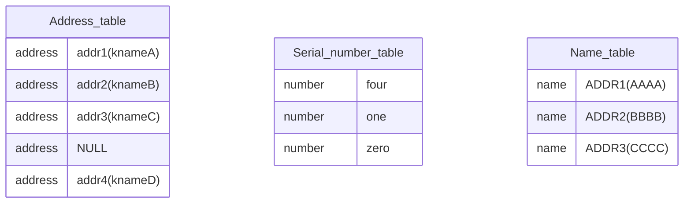

### PE文件结构

###### 总体结构

​​

- 程序在内存中是分节的，每一个节存储不同的数据，硬盘对齐(`200h`)，内存对齐(`1000h`)。因为程序在硬盘上和内存中的状态可能略有不同(以前的程序在内存中与在硬盘上，在内存中节与节之间会有一个"拉伸"过程，节与节之间的空隙变大(填充0)。而现在的程序则并不会。)，这样做可以:

  - 节省硬盘空间。
  - 实现多开(将只读的节保留，将可读可写的节多开，可以节省内存空间)。

  

- 头的大致结构如下：

  |   结构   |
  | :------: |
  |  DOS头   |
  | 标准PE头 |
  | 可选PE头 |
  |   节表   |
  
  

**结构解释：**

1. DOS头（`IMAGE_DOS_HEADER`）最早是为16位的DOS程序设计的，因此包含了一些与DOS相关的信息。现代的Windows可执行文件（PE格式）仍然保留了DOS头，以便在DOS环境下运行时能显示“此程序不能在DOS模式下运行”的消息。DOS头的第一个字段是`WORD e_magic`，通常为`0x5A4D`，即字符“MZ”，用于标识这是一个有效的DOS可执行文件头。另一个重要字段是`DWORD e_lfanew`，它保存了PE头（`IMAGE_NT_HEADERS`）在文件中的偏移量。程序在解析PE文件时，会从`e_lfanew`字段找到PE头的位置。值得注意的是，在`e_lfanew`和PE标识符（“PE”，即`0x5045`）之间的部分数据通常被认为是“垃圾数据”，这些数据在现代Windows系统中没有实际用途，只是为了保持文件结构的兼容性。

   ```
   	1、DOS头：										
   											
   	WORD   e_magic                *				"MZ标记" 用于判断是否为可执行文件.						
   	DWORD  e_lfanew;              *				PE头相对于文件的偏移，用于定位标准PE头
   ```

   

2. 在找到PE标识符“PE\0\0”（`0x50450000`）后，接下来就是（`IMAGE_NT_HEADERS`）**NT头**的内容。

   ```c
   typedef struct _IMAGE_NT_HEADERS {
       DWORD Signature;                 // 文件签名，通常为'PE\0\0'（0x00004550），用于标识这是一个有效的PE文件
       IMAGE_FILE_HEADER FileHeader;    // 标准PE头，包含文件的基本信息
       IMAGE_OPTIONAL_HEADER OptionalHeader; // 可选PE头，包含加载和运行时的详细信息
   } IMAGE_NT_HEADERS, *PIMAGE_NT_HEADERS;
   ```

   文件签名紧随其后的是`FileHeader`（`IMAGE_FILE_HEADER`），通常被称为**标准PE头**或`COFF`头，包含文件的基本信息。

   ```
   2、标准PE头：										
   											
   	WORD    Machine;              *				程序运行的CPU型号：0x0 任何处理器/0x14C 386及后续处理器						
   	WORD    NumberOfSections;     *				文件中存在的节的总数,如果要新增节或者合并节 就要修改这个值.						
   	DWORD   TimeDateStamp;        *				时间戳：文件的创建时间(和操作系统的创建时间无关)，编译器填写的.						
   	DWORD   PointerToSymbolTable;
   
   	DWORD   NumberOfSymbols;
   
   	WORD    SizeOfOptionalHeader; *				可选PE头的大小，32位PE文件默认E0h 64位PE文件默认为F0h  大小可以自定义.						
   	WORD    Characteristics;      *				每个位有不同的含义，可执行文件值为10F 即0 1 2 3 8位置1 				
   ```

   `Characteristics` 标志位如下：

   | 标号 | Characteristics 标志位             |                        属性                        |
   | :--- | :--------------------------------- | :------------------------------------------------: |
   | 0    | IMAGE_FILE_RELOCS_STRIPPED         |  重定位信息已被剥离，意味着文件中不包含重定位信息  |
   | 1    | IMAGE_FILE_EXECUTABLE_IMAGE        |      文件是可执行的，可以作为应用程序直接运行      |
   | 2    | IMAGE_FILE_LINE_NUMS_STRIPPED      |    行号信息已被剥离，意味着文件中不包含行号信息    |
   | 3    | IMAGE_FILE_LOCAL_SYMS_STRIPPED     |  符号信息已被剥离，意味着文件中不包含局部符号信息  |
   | 4    | IMAGE_FILE_AGGRESIVE_WS_TRIM       |              调整工作集，优化内存使用              |
   | 5    | IMAGE_FILE_LARGE_ADDRESS_AWARE     |        应用程序可以处理大于 2GB 的地址空间         |
   | 6    |                                    |            此标志位保留，没有特定的属性            |
   | 7    | IMAGE_FILE_BYTES_REVERSED_LO       | 字节顺序反转（低字节序），文件采用小尾方式存储数据 |
   | 8    | IMAGE_FILE_32BIT_MACHINE           |                只在 32 位平台上运行                |
   | 9    | IMAGE_FILE_DEBUG_STRIPPED          |                   不包含调试信息                   |
   | 10   | IMAGE_FILE_REMOVABLE_RUN_FROM_SWAP |                 不能从可移动盘运行                 |
   | 11   | IMAGE_FILE_NET_RUN FROM_SWAP       |                   不能从网络运行                   |
   | 12   | IMAGE_FILE_SYSTEM                  |         系统文件（如驱动程序),不能直接运行         |
   | 13   | IMAGE_FILE_DLL                     |                 这是一个 DLL 文件                  |
   | 14   | IMAGE_FILE_UP_SYSTEM_ONLY          |           文件不能在多处理器计算机上运行           |
   | 15   | IMAGE_FILE_BYTES_REVERSED_HI       |                      大尾方式                      |

   

3. 紧接着，就是可选(扩展)PE头(`IMAGE_OPTIONAL_HEADER`):

   ```
   3、可选PE头：										
   											
   	WORD    Magic;      		  *		        说明文件类型：10B 32位下的PE文件     20B 64位下的PE文件						
   	BYTE    MajorLinkerVersion;
   
   	BYTE    MinorLinkerVersion;
   
   	DWORD   SizeOfCode;*						所有代码节的和，必须是FileAlignment的整数倍 编译器填的  没用						
   	DWORD   SizeOfInitializedData;*				 已初始化数据大小的和,必须是FileAlignment的整数倍 编译器填的  没用						
   	DWORD   SizeOfUninitializedData;*			 未初始化数据大小的和,必须是FileAlignment的整数倍 编译器填的  没用						
   	DWORD   AddressOfEntryPoint;*				 程序入口						
   	DWORD   BaseOfCode;*						代码开始的基址，编译器填的   没用						
   	DWORD   BaseOfData;*						数据开始的基址，编译器填的   没用						
   	DWORD   ImageBase;*							内存镜像基址						
   	DWORD   SectionAlignment;*					 内存对齐						
   	DWORD   FileAlignment;*						 文件对齐						
   	WORD    MajorOperatingSystemVersion;										
   	WORD    MinorOperatingSystemVersion;										
   	WORD    MajorImageVersion;										
   	WORD    MinorImageVersion;										
   	WORD    MajorSubsystemVersion;										
   	WORD    MinorSubsystemVersion;										
   	DWORD   Win32VersionValue;										
   	DWORD   SizeOfImage;*			 内存中整个PE文件的映射的尺寸，可以比实际的值大，但必须是SectionAlignment的整数倍						
   	DWORD   SizeOfHeaders;*						所有头+节表按照文件对齐后的大小，否则加载会出错						
   	DWORD   CheckSum;*							校验和，一些系统文件有要求.用来判断文件是否被修改.						
   	WORD    Subsystem;										
   	WORD    DllCharacteristics;										
   	DWORD   SizeOfStackReserve;*				初始化时保留的堆栈大小 						
   	DWORD   SizeOfStackCommit;*					初始化时实际提交的大小 					
   	DWORD   SizeOfHeapReserve;*					初始化时保留的堆大小 				
   	DWORD   SizeOfHeapCommit;*					初始化时实践提交的大小 				
   	DWORD   LoaderFlags;								
   	DWORD   NumberOfRvaAndSizes;*				目录项数目
   ```

   `DllCharacteristics`属性如下：

   | 标志位 |             DllCharacteristics属性             |            说明            |
   | ------ | :--------------------------------------------: | :------------------------: |
   | 0      |                    Reserved                    |          必须为0           |
   | 1      |                    Reserved                    |          必须为0           |
   | 2      |                    Reserved                    |          必须为0           |
   | 3      |                    Reserved                    |          必须为0           |
   | 4      |                      null                      |            null            |
   | 5      |                      null                      |            null            |
   | 6      |     IMAGE_DLLCHARACTERISTICS_DYNAMIC_BASE      |  DLL可以在加载时被重定位   |
   | 7      |    IMAGE_DLLCHARACTERISTICS_FORCE_INTEGRITY    |   强制代码实施完整性验证   |
   | 8      |       IMAGE_DLLCHARACTERISTICS_NX_COMPAT       |       该映像兼容 DEP       |
   | 9      |     IMAGE_DLLCHARACTERISTICS_NO_ISOLATION      | 可以隔离，但并不隔离此映像 |
   | 10     |        IMAGE_DLLCHARACTERISTICS_NO_SEH         | 没有结构化异常处理（SEH）  |
   | 11     |        IMAGE_DLLCHARACTERISTICS_NO_BIND        |         不绑定映像         |
   | 12     |                    Reserved                    |          必须为0           |
   | 13     |      IMAGE_DLLCHARACTERISTICS_WDM_DRIVER       |  该映像为一个 WDM driver   |
   | 14     |                    Reserved                    |          必须为0           |
   | 15     | IMAGE_DLLCHARACTERISTICS_TERMINAL SERVER_AWARE |      可用于终端服务器      |

   

4. 最后就是节表

   - 如果节相当于书里面的内容，那么节表就相当于书的目录。之前的什么`DOS`头之类的结构就相当于书的出版社什么的信息。

   ```c
   typedef struct _IMAGE_SECTION_HEADER {
       BYTE    Name[IMAGE_SIZEOF_SHORT_NAME];     // 节的名称，长度为8个字节。通常是以"\0"结尾的ASCII字符串，但系统会截取8个字节的内容。名称可以自定义。
       
       union {
           DWORD   PhysicalAddress;               // 在COFF格式中用于指示物理地址。对于PE文件通常不使用。
           DWORD   VirtualSize;                   // 节的虚拟大小。在内存中的实际大小可以与SizeOfRawData不同。
       } Misc;									// 双字是该节在没有对齐前的真实尺寸,该值可以不准确。
       
       DWORD   VirtualAddress;                    // 节在内存中的虚拟地址，加上ImageBase才是内存中的实际地址。
       
       DWORD   SizeOfRawData;                     // 节在文件中的对齐后的大小。在文件中的实际大小。
       
       DWORD   PointerToRawData;                  // 节在文件中的偏移地址，指向节的实际数据。
       
       DWORD   PointerToRelocations;              // 对于obj文件中的重定位信息使用。对于exe文件，通常为0。
       DWORD   PointerToLinenumbers;              // 行号表的偏移，用于调试。对于exe文件，通常为0。
       WORD    NumberOfRelocations;               // 在obj文件中使用，指示节中重定位的数量。对于exe文件，通常为0。
       WORD    NumberOfLinenumbers;               // 行号表中行号的数量，用于调试。对于exe文件，通常为0。
       
       DWORD   Characteristics;                  // 节的属性标志，如是否为可执行代码、是否可读、是否可写等。
   } IMAGE_SECTION_HEADER, *PIMAGE_SECTION_HEADER;			
   ```
   
   所以，节表的结构如下：
   
   
   
   

完整如下：

```
	1、DOS头：										
											
	WORD   e_magic                *				"MZ标记" 用于判断是否为可执行文件.						
	DWORD  e_lfanew;              *				PE头相对于文件的偏移，用于定位PE文件						
											
											
	2、标准PE头：										
											
	WORD    Machine;              *				程序运行的CPU型号：0x0 任何处理器/0x14C 386及后续处理器						
	WORD    NumberOfSections;     *				文件中存在的节的总数,如果要新增节或者合并节 就要修改这个值.						
	DWORD   TimeDateStamp;        *				时间戳：文件的创建时间(和操作系统的创建时间无关)，编译器填写的.						
	DWORD   PointerToSymbolTable;

	DWORD   NumberOfSymbols;

	WORD    SizeOfOptionalHeader; *				可选PE头的大小，32位PE文件默认E0h 64位PE文件默认为F0h  大小可以自定义.						
	WORD    Characteristics;      *				每个位有不同的含义，可执行文件值为10F 即0 1 2 3 8位置1 						
											
	3、可选PE头：										
											
	WORD    Magic;      		  *		        说明文件类型：10B 32位下的PE文件     20B 64位下的PE文件						
	BYTE    MajorLinkerVersion;

	BYTE    MinorLinkerVersion;

	DWORD   SizeOfCode;*						所有代码节的和，必须是FileAlignment的整数倍 编译器填的  没用						
	DWORD   SizeOfInitializedData;*				 已初始化数据大小的和,必须是FileAlignment的整数倍 编译器填的  没用						
	DWORD   SizeOfUninitializedData;*			 未初始化数据大小的和,必须是FileAlignment的整数倍 编译器填的  没用						
	DWORD   AddressOfEntryPoint;*				 程序入口						
	DWORD   BaseOfCode;*						代码开始的基址，编译器填的   没用						
	DWORD   BaseOfData;*						数据开始的基址，编译器填的   没用						
	DWORD   ImageBase;*							内存镜像基址						
	DWORD   SectionAlignment;*					 内存对齐						
	DWORD   FileAlignment;*						 文件对齐						
	WORD    MajorOperatingSystemVersion;										
	WORD    MinorOperatingSystemVersion;										
	WORD    MajorImageVersion;										
	WORD    MinorImageVersion;										
	WORD    MajorSubsystemVersion;										
	WORD    MinorSubsystemVersion;										
	DWORD   Win32VersionValue;										
	DWORD   SizeOfImage;*			 内存中整个PE文件的映射的尺寸，可以比实际的值大，但必须是SectionAlignment的整数倍						
	DWORD   SizeOfHeaders;*						所有头+节表按照文件对齐后的大小，否则加载会出错						
	DWORD   CheckSum;*							校验和，一些系统文件有要求.用来判断文件是否被修改.						
	WORD    Subsystem;										
	WORD    DllCharacteristics;										
	DWORD   SizeOfStackReserve;*				初始化时保留的堆栈大小 						
	DWORD   SizeOfStackCommit;*					初始化时实际提交的大小 					
	DWORD   SizeOfHeapReserve;*					初始化时保留的堆大小 				
	DWORD   SizeOfHeapCommit;*					初始化时实践提交的大小 				
	DWORD   LoaderFlags;								
	DWORD   NumberOfRvaAndSizes;*				目录项数目
```

- PE加载的过程：

  1. 根据`SizeOfImage`的大小，开辟一块缓冲区(`ImageBuffer`)
  2. 根据`SizeOfHeader`的大小，将头信息从`FileBuffer`拷贝到`ImageBuffer`
  3. 根据节表中的信息循环将`FileBuffer`中的节拷贝到`ImageBuffer`中

  

###### ‍RVA与FOA的转换

因为运行的程序全局变量的初始值在未运行的程序中也存在，所以我们如何通过运行程序的地址的值，来推出程序在未运行时这个值对应的地址。

1. `‍RVA`相对虚拟地址

   `‍RVA=address(程序运行时要找值的地址)-ImageBase`

2. `FOA`文件偏移地址(程序未运行要找的地址)

3. 对应关系(不过现在的程序运行和未运行是对齐都相等，所以直接`FOA=RVA`)：

   - 如果在头部(前面没有节的对齐) `FOA=RVA`

   - 不在头部(节内的差值是相同的)

```
RVA >=节.VirtualAddress

RVA <= 节.VirtualAddress + 当前节内存对齐后的大小

差值 = RVA - 节.VirtualAddress

FOA =节.PointerToRawData +差值
```

###### 实验：在编译好的程序执行前弹个窗口

1. 汇编对应硬编码

   `6A 00` ：`push 0`	`E8 跳转值` ：`call 要跳转的地址`

2. 计算要跳转地址的硬编码：

```
跳转值=要跳转的地址-E8(call)指令当前的地址-5(对齐到下一个指令)
```

###### 扩大节

当我们想添加的代码或者`shellcode`比较多，程序没地方写的话可以选择扩大节，由于对齐的原因，扩大最后一个节对其他节的影响最小，是最优选择

扩大节的步骤：

1. 分配一块新的空间,大小为`S`

2. 将最后一个节的`SizeOfRawData`和`VirtualSize`改成`N`

   `N = (SizeOfRawData或者VirtualSize内存对齐后的值) + S`

3. 修改`SizeOflmage`大小

###### 新增节

新增节的步骤：

1. 判断是否有足够的空间,可以添加一个节表.
2. 在节表中新增一个成员.
3. 修改`PE`头中节的数量.
4. 修改`sizeOflmage`的大小.
5. 再原有数据的最后,新增一个节的数据(内存对齐的整数倍).
6. 修正新增节表的属性.

###### 静态链接库-动态链接库

静态链接库：

- 将`xxx.h`和`xxx.lib`复制到要使用的项目中（就是你写的`lib`）
- 在需要使用的文件中包含：`#include "xxx.h"`
- 在需要使用的文件中包含：`#pragma comment(lib, "xxx.lib")`；或者改项目设置中的`link`将`xxx.lib`加入

> 使用静态链接库其实就是把你写的`xxx.h`文件里的函数全部编译到程序里面了，使用静态链接生成的可执行文件体积较大，造成浪费。

动态链接库：

- 隐式链接：（就是编译器替你去链接）

  - 将`*.dll  *.lib`放到工程目录下面（主要功能在`dll`里面，这个`lib`其实就是告诉程序函数在哪里）

  - 将`#pragma comment(lib,"DLL名.lib")`添加到调用文件中

  - 加入函数的声明：

    ```c
    extern "C" __declspec(dllimport) __stdcall int Plus (int x,int y);
    extern "C" __declspec(dllimport) __stdcall int Sub (int x,int y);
    extern "C" __declspec(dllimport) __stdcall int Mul (int x,int y);
    extern "C" __declspec(dllimport) __stdcall int Div (int x,int y);
    ```

    > `__declspec(dllimport)`告诉编译器此函数为导入函数；
    >
    > `__declspec(dllexport)`告诉编译器此函数为导出函数；
    >
    > `extern "C"`的意思是用`C`语言的语法进行编译和链接，去掉的话函数名称后面会加乱码，作用是名称粉碎

- 显示链接：（自己去链接）

  - 定义函数指针：

    ```c
    typedef int (__stdcall *lpPlus)(int,int);
    typedef int (__stdcall *lpSub)(int,int);
    typedef int (__stdcall *lpMul)(int,int);
    typedef int (__stdcall *lpDiv)(int,int);
    //定义新的类型
    ```

  - 声明函数指针变量：

    ```c
    lpPlus myPlus;
    lpSub mySub;
    lpMul myMul;
    lpDiv myDiv;
    ```

  - 动态加载`dll`到内存中：

    ```c
    HINSTANCE   hModule = LoadLibrary("DllDemo.dll"); 
    ```

  - 获取函数地址：

    ```c
    myPlus = (lpPlus)GetProcAddress(hModule,   "_Plus@8");
    mySub = (lpSub)GetProcAddress(hModule,   "_Sub@8");
    myMul = (lpMul)GetProcAddress(hModule,   "_Mul@8");
    myDiv = (lpDiv)GetProcAddress(hModule,   "_Div@8");
    //@后面的8是指后面有两个参数，一个参数4字节
    ```

  - 调用函数：

    ```c
    int a = myPlus(10,2);
    int b = mySub(10,2);
    int c = myMul(10,2);
    int d = myDiv(10,2);
    ```

    > `Handle`是代表系统的内核对象，如文件句柄，线程句柄，进程句柄。其实就是操作系统分的一个文件编号，线程编号或者是进程编号。避免用户将句柄进行运算（`unsign`4字节）
    >
    > `GetProcAddress`的第一个参数`hModule`其实就是模块的`RVA`

- 使用序号导出：

  - `*.h`文件：

    ```c
    int Plus (int x,int y);
    int Sub (int x,int y);
    int Mul (int x,int y);
    int Div (int x,int y);
    ```

  - `*.cpp`文件：

    ```c
    int Plus(int x,int y)
    {
    	return x+y;
    }
    int Sub(int x,int y)
    {
    	return x-y;
    }
    int Mul(int x,int y)
    {
    	return x*y;
    }
    int Div(int x,int y)
    {
    	return x/y;	
    }
    ```

  - `*.def`文件：

    ```
    EXPORTS
    
    Plus @12
    Sub	@15 NONAME
    Mul @13
    Div @16
    ```

    后面的数字就是函数的导出序号，`NONAME`指的是无名字，隐藏名称

    > 名字是一段程序就精华的注释,通过名字可以直接猜测到函数的功能，通过使用序号，可以达到隐藏的目的.

###### 导出表

一个程序是由多个配文件所组成，那么这个程序使用了哪些`dll`文件，会在一个表中记录，这就是导入表；同样的，有哪些程序使用了我这个程序的函数，也会记录在一个表内，这个表是导出表。

如何找到导出表：`pe`文件结构中最后一个结构中的第一个结构体，那里存放着导出表的地址(`rva`)和大小(`size`)

请注意，这个大小(`size`)指的是导出表中的指针指向的内容的和大小（比如`name`指针指向的字段以`\x00`截至，等等的所有字段和加上固定的40个字节，只是编译器填的值，无实际意义）

```c
IMAGE_DIRECTORY_ENTRY_EXPORT
    
struct_IMAGE_DATA_DIRECTORY { 
0x00 DWORD VirtualAddress; 
0x04 DWORD Size;
}
```

通过这个地址就可以找到导出表，结构如下：

```c
typedef struct _IMAGE_EXPORT_DIRECTORY {
    DWORD   Characteristics;        //未使用
    DWORD   TimeDateStamp;          //时间戳
    WORD    MajorVersion;           //未使用
    WORD    MinorVersion;           //未使用
    DWORD   Name;                   //指向改导出表文件名字符串
    DWORD   Base;                   //导出表的起始序号
    DWORD   NumberOfFunctions;      //导出函数的个数(更准确来说是AddressOfFunctions的元素数，而不是函数个数)
    DWORD   NumberOfNames;          //以函数名字导出的函数个数
    DWORD   AddressOfFunctions;     //导出函数地址表RVA:存储所有导出函数地址(表元素宽度为4，总大小NumberOfFunctions * 4)
    DWORD   AddressOfNames;         //导出函数名称表RVA:存储函数名字符串所在的地址(表元素宽度为4，总大小为NumberOfNames * 4)
    DWORD   AddressOfNameOrdinals;  //导出函数序号表RVA:存储函数序号(表元素宽度为2，总大小为NumberOfNames * 2)
} IMAGE_EXPORT_DIRECTORY, *PIMAGE_EXPORT_DIRECTORY;
```

1.导出的函数要么用名字导出，要么用序号导出(隐藏)，总数为`NumberOfNames`的值

一共有三个表，地址表，序号表，名称表

其中：序号表的数量与名称表的数量相同。

比如：

|    地址表     | 序号表(2字节) |   名称表    |
| :-----------: | :-----------: | :---------: |
| addr1(knameA) |       4       | ADDR1(AAAA) |
| addr2(knameB) |       1       | ADDR2(BBBB) |
| addr3(knameC) |       0       | ADDR3(CCCC) |
|   00000000    |               |             |
| addr4(knameD) |               |             |



**通过名字找函数时**：（按照名称找函数地址）


1. 首先遍历名称表，比如找到名称`AAAA`函数，发现是表中的第`0`号成员。
2. 通过①中的`0`直接查询序号表中的`0`号成员，发现是数字`4`
3. 通过②中的`4`直接查找地址表中的第`4`号成员，为`addr4(knameD)`，所以`knameD`就是`AAAA`（从`0`开始数）

相反过程：（知道函数地址找函数名）


1. 比如知道函数的地址为`addr1(knameA)`，发现是地址表中的第`0`号成员。
2. 通过①中的`0`直接查询序号表中的成员哪个是`0`，发现是第二个索引
3. 直接对应名称表的第二个索引，所以`ADDR3(CCCC)`就是`addr1(knameA)`

**通过序号找函数时**：（按照序号找函数地址）


1. 将导出序号减去导出表的起始序号(`Base`的值)。
2. 将这个值直接对应地址表，就找到了。

**序号表与名称表是对应的，地址表是靠序号表索引得到的**

###### 重定位表

如果两个`dll`文件在导入内存时，导入在相同的`ImageBase`的偏移处，该怎么办？只需要修正其中一个`dll`文件的偏移在没有文件导入的内存偏移，即可。但这两个`dll`中的全局变量的硬编码可能会有相同的偏移。这时就需要使用重定位表了

数据目录项的第6个结构，就是重定位表（相对于映像基址的偏移量）。


结构如下：

```C
typedef struct _IMAGE_BASE_RELOCATION {
	DWORD VirtualAddress;
	DWORD SizeOfBlock; //字节为单位
} IMAGE_BASE_RELOCATION;
```

1. 这个结构体中的第二个成员`SizeOfBlock`是当前重定位块的总大小，就是加上`VirtualAddress`成员的大小。
2. 当遇到全为`\x00`时(`8`个)，说明已经结束了。

比如其中一个重定位块如下：

| Virtual  |          |          |          |
| :------: | :------: | :------: | :------: |
|   Size   |          |          |          |
| 0011#### | ######## | 0011#### | ######## |
| 0011#### | ######## | 0011#### | ######## |

说明：`Virtual`代表`VirtualAddress`成员，`Size(0x10)`代表`SizeOfBlock`成员，`#`代表一位的数据，一个框代表一个字节。`2^12=4096`，即为一页对齐的数据，所以使用两个字节(`16`位其中的低`12`位)来存放地址，其中的高4位的作用是：当高4位的值为3(0011=3，不是3时就是垃圾！)时，说明该地址有意义重定位，应当`重定位的值=VirtualAddress成员+低12位`

###### 移动导出表，重定向表

1. 在`DLL`中新增一个节，并返回新增后的`FOA`
2. 复制`AddressOfFunctions`	长度：`4*NumberOfFunctions`
3. 复制`AddressOfNameOrdinals`	长度：`NumberOfNames*2`
4. 复制`AddressOfNames`	长度：`NumberOfNames*4`
5. 复制所有的函数名	长度不确定，复制时直接修复`AddressOfNames`
6. 复制`IMAGE_EXPORT_DIRECTORY`结构
7. 修复`IMAGE_EXPORT_DIRECTORY`结构中的	`AddressOfFunctions`	`AddressOfNameOrdinals`	`AddressOfNames`
8. 修复目录项中的值，指向新的`IMAGE_EXPORT_DIRECTORY`

###### 导入表

导入表就像程序的“借用清单”，告诉它运行时需要调用哪些外部函数以及从哪里找到它们。

1. 依赖一个模块就会有一个导入表，所以导入表有很多。
2. 遇到连续`20`个`\x00`说明导入表结束了

结构如下：

```c
typedef struct_IMAGE_IMPORT_DESCRIPTOR 
union {
DWORD Characteristics;
DWORD OriginalFirstThunk;			  //RVA指向IMAGE_THUNK_DATA结构数组
};
DWORD TimeDateStamp;				 //时间戳
DWORD ForwarderChain;
DWORD Name;							 //RVA,指向dl名字，该名字已0结尾
DWORD FirstThunk;					 //RVA,指向IMAGE_THUNK_DATA结构数组
}IMAGE_IMPORT_DESCRIPTOR;
```

其中:

1. `OriginalFirstThunk`成员和`FirstThunk`成员又分别指向了`INT`（导入名称表）和`IAT`（导入地址表），这两张表位置和名称都不同，但内容却相同，都能找到函数名称。
2. 当遇到全为`\x00`时，说明已经结束了。
3. 成员有多少个，该程序就使用了这个`dll`中的多少个函数。


```c
typedef struct_IMAGE_THUNK_DATA32
union{
	PBYTE ForwarderString;
	PDWORD Function;
	DWORD Ordinal;						//序号
	PIMAGE_IMPORT_BY_NAME AddressOfData;  //指向IMAGE_IMPORT_BY_NAME
}u1;
}IMAGE_THUNK_DATA32;

```

在`OriginalFirstThunk`中的`IMAGE_THUNK_DATA32`成员。判断最高是否为`1`，如果是，那么除去最高位的值就是函数的导出序号(按序号导入)；如果不是，那么这个值是一个`RVA`指向`IMAGE_IMPORT_BY_NAME`

```c
typedef struct_IMAGE_IMPORT_BY_NAME {
	WORD Hint;							//可能为空,编译器决定如果不为空是函数在导出表中的索引
	BYTE Name[1];						//函数名称，以0结尾
}IMAGE IMPORT BY NAME, *PIMAGE IMPORT BY NAME;
```

`Hint`成员如果不为空，则直接找导出表中地址表的索引，直接可以找到函数。

`Hint`成员如果为空，则通过`Name[1]`来确定函数叫说明名字，之所以是`1`字节，是因为函数不知道函数名称的长度，所以确定第一个字节之后一直找，遇到`\x00`结束，就是函数的名称。

确定函数地址：


1. 在使用其他`dll`中的函数，使用的`call`都是间接`call`。间接`call`会提供一个地址编号来存放函数的地址，那么这个地址所在的表就是导入地址表(`IAT`)。
2. `PE`文件加载前后`IAT`表会发生变化，会存放函数的地址(也就是通过函数的名称进而得到函数的地址)。
3. 为什么有两条线？如果`IAT`表的这条线被破坏，则可以通过`INT`表进行修正。

###### 绑定导入表

在系统自提供的`.exe`程序中，可以发现`IAT`表里面是一个地址，并且和`INT`表的值不同。这个情况其实可以等价于`PE`文件加载后的状态，可以提高程序的执行速度。

- `PE`加载`EXE`相关的`DLL`时，首先会根据`IMAGE_IMPORT_DESCRIPTOR`结构中的`TimeDateStamp`来判断是否要重新计算`IAT`表中的地址。

  | TimeDateStamp |                             状态                             |
  | :-----------: | :----------------------------------------------------------: |
  |       0       |                            未绑定                            |
  |       1       | 已绑定（真正的绑定时间为`IMAGE_BOUND_IMPORT_DESCRIPTOR`的`TimeDateStamp`） |

- 结构如下：

  ```c
  typedef struct _IMAGE_BOUND_IMPORT_DESCRIPTOR {
      DWORD   TimeDateStamp;
      WORD    OffsetModuleName;
      WORD    NumberOfModuleForwarderRefs;
  // Array of zero or more IMAGE_BOUND_FORWARDER_REF follows
  } IMAGE_BOUND_IMPORT_DESCRIPTOR,  *PIMAGE_BOUND_IMPORT_DESCRIPTOR;
  
  typedef struct _IMAGE_BOUND_FORWARDER_REF {
      DWORD   TimeDateStamp;
      WORD    OffsetModuleName;
      WORD    Reserved;
  } IMAGE_BOUND_FORWARDER_REF, *PIMAGE_BOUND_FORWARDER_REF;
  ```

  注意：对应`dll`的名称是`第一个_IMAGE_BOUND_IMPORT_DESCRIPTOR的地址 + 对应的OffsetModuleName`

- 当`IMAGE_BOUND_IMPORT_DESCRIPTOR`结构中的`TimeDateStamp`与`DLL`文件标准`PE`头中的`TimeDateStamp`值不相符时，或者`DLL`需要重新定位的时候，就会重新计算`IAT`中的值

###### 注入入门

当`Exe`被加载时，系统会根据`Exe`导入表信息来加载需要用到的`DLL`，导入表注入的原理就是修改`exe`导入表，将自己的`DLL`添加到`exe`的导入表中，这样`exe`运行时可以将自己的`DLL`加载到`exe`的进程空间。

- 注入的种类：

  1. 注册表注入
  2. 导入表注入
  3. 特洛伊注入
  4. 远程线程注入
  5. 无`DLL`注入
  6. `Apc`注入
  7. `Windows`挂钩注入`DLL`
  8. 输入法注入

- 导入表注入的实现步骤：

  1. 根据目录项（第二个就是导入表）得到导入表信息：

     ```c
     typedef struct _IMAGE_DATA_DIRECTORY {
         DWORD   VirtualAddress;
         DWORD   Size;
     } IMAGE_DATA_DIRECTORY, *PIMAGE_DATA_DIRECTORY;
     
     //VirtualAddress :指向导入表结构
     //Size:导入表的总大小
     //这两个值都需要
     ```

  2. ```c
     typedef struct _IMAGE_IMPORT_DESCRIPTOR {
         union {
             DWORD   Characteristics;
             DWORD   OriginalFirstThunk;
         };
         DWORD   TimeDateStamp;
         DWORD   ForwarderChain;
         DWORD   Name;
         DWORD   FirstThunk;
     } IMAGE_IMPORT_DESCRIPTOR;
     typedef IMAGE_IMPORT_DESCRIPTOR UNALIGNED *PIMAGE_IMPORT_DESCRIPTOR;
     ```

     

     ```
     新增一个导入表需要的空间：
     A:20字节
     B:16字节		
     C:取决于DLL名串的长度+1
     D:取决于函数名的长度+1+2
     ```

     ```
     判断哪一个节的空白区 > Size(原导入表的大小) + 20 + A + B + C + D
     如果空间不够：可以将C/D 存储在其他的空白区也就是，只要空白区 > Size + 0x20就可以了
     如果仍然不够，就需要扩大最后一个节，或者新增节来解决.
     ```

  3. 将原导入表全部`Copy`到空白区

  4. 在新的导入表后面，追加一个导入表

  5. 追加`8`个字节的`INT`表和 `8`个字节的`IAT`表

  6. 追加一个`IMAGE_IMPORT_BY_NAME`结构，前`2`个字节是`0`后面是函数名称字符串

  7. 将`IMAGE_IMPORT_BY_NAME`结构的`RVA`赋值给`INT`和`IAT`表中的第一项

  8. 分配空间存储`DLL`名称字符串 并将该字符串的`RVA`赋值给`Name`属性

  9. 修正`IMAGE_DATA_DIRECTORY`结构的`VirtualAddress`和`Size`

### win32

###### 宽字符

- 概述：

  `ASCII`编码无法满足我们输入的中文文字。便引入了扩展`ASCII`表，原来的`ASCII`表进行扩展，将`0x80~0xff`的两个符号拼起来组成新的文字(`GB2312`)，就可以显示中文了。但是不同国家有不同的规则，那么中文文字发送过去会产生乱码。为了解决这个问题，就产生了`Unicode`编码，`unicode`编码是将世界上所有的字符建立与`0~0x10ffff`的对应。但是`Unicode`编码长度可能的`1`或`2`或`3`字节，这样不好存储。

- `UTF-16`:

  `UTF-16`编码以`16`位无符号整数为单位，注意是`16`位为一个单位，不表示一个字符就只有`16`位。这个要看字符的`Unicode`编码处于什么范围而定，有可能是`2`个字节，也可能是`4`个字节现在机器上的`Unicode`编码一般指的就是`UTF-16`。

- `UTF-8`:

  不同的`16`进制码用不同的`UTF-8`规则编码

  | Unicode编码(6进制) |        UTF-8 字节流(二进制)         |
  | :----------------: | :---------------------------------: |
  |  000000 - 00007F   |              0xxxxxxx               |
  |  000080 - 0007FF   |         110xxxxx  10xxxxxx          |
  |  000800 - 00FFFF   |     1110xxxx 10xxxxxx  10xxxxxx     |
  |   010000 -10FFFF   | 11110xxx 10xxxxxx 10xxxxxx 10xxxxxx |

- `BOM`（`Byte Order Mark`）:

  放在`UTF-8`或`UTF-16`编码的前面，让计算机知道这是什么方式编码的

  |      BOM       |          |
  | :------------: | :------: |
  |     UTF-8      | EF BB BF |
  | UTF-16LE(小端) |  FF FE   |
  | UTF-16BE(大端) |  FE FF   |

- `c`语言中的宽字节：

  ```c++
  char szStr[]= "中国";				//2D 4E FD 56 00			(GB2312编码)
  wchar_t swzStr]=L"中国";			//D6 D0 B9 FA 00 00		(Unicode编码)宽字节
  ```

  注意：宽字符是以`00 00`为终止符的。

- `win32 api`中的宽字节：

  - 在`win32`编程中都是见过的类型，只不过是换了一个名字而已。
  - `Windows`提供的`API`凡是需要传递字符串参数的函数，都会提供两个版本和一个宏（比如：`MessageboxA` `MessageboxW`），为了使`ASCII`编码和`Unicode`编码有区分。

  |     字符类型     |           字符串指针            |
  | :--------------: | :-----------------------------: |
  |   `char，CHAR`   | `PTSTR(LPTSTR)`指向多字节字符串 |
  | `wchar_t，WCHAR` |   `PTSTR(LPTSTR)`指向宽字符串   |
  |   宏   `TCHAR`   |       宏  `PTSTR(LPTSTR)`       |

- 为字符串指针赋值：

  ```c++
  PSTR pszChar = "china";			//多字节字符
  PWSTR pszWChar = L"china";		//宽字符
  PTSTR pszTChar = TEXT("china");	//如果项目是ASCII的，相当于"china"；如果项目是UNICODE，相当于L"china"
  ```

  字符数组赋值：

  ```c++
  CHAR cha[] = "中国";
  WCHAR chw[] = L"中国";
  TCHAR cht[] = TEXT("中国");
  ```

- 函数的不同：

  |   普通   |  宽字符   |            功能             |
  | :------: | :-------: | :-------------------------: |
  | `printf` | `wprintf` |      打印到控制台函数       |
  | `strlen` | `wcslen`  |          获取长度           |
  | `strcpy` | `wcscpy`  |         字符串复制          |
  | `strcat` | `wcscat`  |         字符串拼接          |
  | `strcmp` | `wcscmp`  |         字符串比较          |
  | `strstr` | `wcsstr`  |         字符串查找          |
  |  `char`  | `wchar_t` | 多字节字符类型   宽字符类型 |

- 调试函数：

  ```c++
  //.h
  void __cdecl OutputDebugStringF(const char *format, ...);
  
  #ifdef _DEBUG
  #define DbgPrintf   OutputDebugStringF
  #else
  #define DbgPrintf
  #endif
  
  //.cpp
  void __cdecl OutputDebugStringF(const char *format, ...)
  {
      va_list vlArgs;
      char    *strBuffer = (char*)GlobalAlloc(GPTR, 4096);
  
      va_start(vlArgs, format);
      _vsnprintf(strBuffer, 4096 - 1, format, vlArgs);
      va_end(vlArgs);
      strcat(strBuffer, "\n");
      OutputDebugStringA(strBuffer);
      GlobalFree(strBuffer);
      return;
  }
  ```

###### 事件-消息

- `Windows`中的事件是一个“动作”，这个动作可能是用户操作应用程序产生的，也可能是`Windows`自己产生的。而消息，就是用来描述这些“动作”的，比如：这个动作是什么时候产生的？哪个应用程序产生的？在什么位置产生的？等等……

- `Windows`为了能够准确的描述这些信息，提供了一个结构体：`MSG`，该结构体里面记录的事件的详细信息

  ```c++
  typedef struct tagMSG {
    HWND   hwnd;    //表示消息所属的窗口，一个消息一般都是与某个窗口相关联的，在Windows中HWND类型的变量通常用来标识窗口。
    UINT   message;    //在Windows中，消息是由一个数值来表示的，但是由于数值不便于记忆，所以Windows将消息对应的数值定义为WM_XXX宏（WM == Window Message）比如：鼠标左键按下->WM_LBUTTONDOWN    键盘按下->WM_KEYDOWN
    WPARAM wParam;    //32位消息的特定附加信息,具体表示什么处决于message
    LPARAM lParam;    //与上一个一样
    DWORD  time;    //消息创建时的时间
    POINT  pt;    //消息创建时的鼠标位置(x轴与y轴)
  } MSG, *PMSG;
  ```

- 完整的一个消息流程

  ```mermaid
  graph TB
      A[系统/用户触发的某个动作-->事件] --> B[系统将这些信息存储到MSG结构体中-->消息];
      B --> C[系统将该消息存储到相关应用程序的消息队列中-->消息队列];
      C --> D[循环开始-->从队列中循环获取消息];
      D --> H{GetMessage（&Msg,NULL,0,0）?};
      H -- 是 (Yes) --> I[TranslateMessage（&Msg）//翻译消息];
      I --> J[DispatchMessage（&Msg）//派发消息];
      J --> D;
      H -- 否 (No) --> K[循环结束];
      
      K --> E[DispatchMessage将加工过的消息传递给操作系统];
      E --> F[系统调用窗口过程函数];
      F --> G{WindowProc函数  //窗口过程函数};
  
  ```

  系统消息队列与应用程序消息队列：

  

  其实整体的过程就是从消息队列中取出消息，判断消息是不是我关系的消息。如果是就处理消息；如果不是就让系统去处理消息

###### 子窗口-消息处理函数

- 按钮事件的处理：

  按钮的`WNDCLASS`不是我们定义的，是系统预定义好的。

- 回调函数的结构

  ```c++
  LRESULT CALLBACK WindowProc(
  	IN  HWND hwnd,
  	IN  UINT uMsg,
  	IN  WPARAM wParam,
  	IN  LPARAM lParam
  	);
  ```

  回调函数的堆栈

  ```mermaid
  erDiagram
  	stack {
          ESP return_address
          ESP_4 hwnd
          ESP_8 uMsg
          ESP_c wParam
          ESP_10 lParam
      }
  
  ```

  

- 总结：

  1. 按钮是一种特殊的窗体，并不需要提供单独的窗口回调函数

  2. 当按钮有事件产生时，会给父窗口消息处理程序发送一个`WM_COMMAND`消息

     ```mermaid
     graph TB
         A[按钮] --单击按钮--> B[系统提供WinProc];
         B --转换WM_COMMAND--> C[父窗口的WinProc];
     ```

###### 资源表（PE）


- 资源目录（图中绿色的）：

  ```c++
  typedef struct _IMAGE_RESOURCE_DIRECTORY {
      DWORD   Characteristics;						//资源属性  保留 0
      DWORD   TimeDateStamp;							//资源创建的时间
      WORD    MajorVersion;							//资源版本号 未使用 0
      WORD    MinorVersion;							//资源版本号 未使用 0
      WORD    NumberOfNamedEntries;					//以名称命名的资源数量
      WORD    NumberOfIdEntries;						//以ID命名的资源数量
  //  IMAGE_RESOURCE_DIRECTORY_ENTRY DirectoryEntries[];
  } IMAGE_RESOURCE_DIRECTORY, *PIMAGE_RESOURCE_DIRECTORY;
  ```

- 资源目录项（图中黄色的）：

  ```c++
  typedef struct _IMAGE_RESOURCE_DIRECTORY_ENTRY {
      union {									//目录项的名称、或者ID
          struct {
              DWORD NameOffset:31;    //低31位
              DWORD NameIsString:1;    //最高1位
          };
          DWORD   Name;    //在第一层中代表光标，位图等16种预定义类型。而在第二层代表资源编号
          WORD    Id;
      };
      union {
          DWORD   OffsetToData;				//目录项指针
          struct {
              DWORD   OffsetToDirectory:31;
              DWORD   DataIsDirectory:1;
          };
      };
  } IMAGE_RESOURCE_DIRECTORY_ENTRY, *PIMAGE_RESOURCE_DIRECTORY_ENTRY;
  ```

  - `OffsetToData`的含义：

    1. 最高位如果为`1`：`低31位 + 资源地址 == 下一层目录节点的起始位置`
    2. 最高位如果为`0`，指向`IMAGE_RESOURCE_DATA_ENTRY`
    3. 第一层、第二层全为`1`，第三层为`0`

  - 在`Name`的`union`中

    - 当最高位是`1`时，低`31`位是一个`UNICODE`指针，指向一个结构：

      ```c++
      typedef struct _IMAGE_RESOURCE_DIR_STRING_U {
          WORD    Length;
          WCHAR   NameString[ 1 ];
      } IMAGE_RESOURCE_DIR_STRING_U, *PIMAGE_RESOURCE_DIR_STRING_U;
      ```

    - 当最高位是`0`时，表示字段的值作为`ID`使用

- 数据项（图中橙色的）：

  ```c++
  typedef struct _IMAGE_DATA_DIRECTORY {
      DWORD   VirtualAddress;
      DWORD   Size;
  } IMAGE_DATA_DIRECTORY, *PIMAGE_DATA_DIRECTORY;
  ```

  其中，简体中文：`2052`

###### WM_NOTIFY

- 概述：

  1. 该消息类型与`WM_COMMAND`类型相似，都是由子窗口向父窗口发送的消息。
  2. `WM_NOTIFY`可以包含比`WM_COMMAND`更丰富的信息。
  3. `Windows`通用组件中有很多消息，都是通过`WM_NOTIFY`来描述的。

- `WM_NOTIFY`消息中的参数如下：

  `wParam`：控件`ID`

  `lParam`：指向一个结构：

  ```c++
  typedef struct tagNMHDR {
          HWND hwndFrom; //发送通知消息的控制窗口句柄
          UINT idFrom;   //发送通知消息的控制ID值
          UINT code;     //通知码，如LVM_SELCHANGED
      } NMHDR;
  ```

  这个结构体能满足一般的要求，但能描述的信息还是有限的

  解决方案：对每种不同用途的通知消息都定义另一种结构来表示

  ```c++
  typedef struct tagNMLVCACHEHINT {
      NMHDR   hdr;
      int     iFrom;
      int     iTo;
  } NMLVCACHEHINT, *PNMLVCACHEHINT;
  
  typedef struct tagLVDISPINFO {
      NMHDR hdr;
      LVITEM item;
  } NMLVDISPINFO, FAR *LPNMLVDISPINFO;
  
  typedef struct _NMLVFINDITEM {
      NMHDR hdr;
      int iStart;
      LVFINDINFO lvfi;
  } NMLVFINDITEM, *PNMLVFINDITEM;
  ```

###### 线程

- 线程是由`Windows`内核负责创建与管理的，句柄相当于一个令牌，有了这个令牌就可以使用线程对象。

  线程`ID`是身份证，唯一的，系统进行线程调度的时候要使用的

- 创建线程：

  ```c++
  HANDLE CreateThread(
    LPSECURITY_ATTRIBUTES lpThreadAttributes, // 安全属性 通常为NULL
    SIZE_T dwStackSize,                       // 参数用于设定线程可以将多少地址空间用于它自己的堆栈，每个线程拥有它自己的堆栈
    LPTHREAD_START_ROUTINE lpStartAddress,    // 参数用于指明想要新线程执行的线程函数的地址
    LPVOID lpParameter,                       // 线程函数的参数，在线程启动执行时将该参数传递给线程函数。既可以是数字，也可以是指向包含其他信息的一个数据结构的指针
    DWORD dwCreationFlags,                    // 0 创建完毕立即调度  CREATE_SUSPENDED创建后挂起
    LPDWORD lpThreadId                        // 线程ID
  );
  				        					// 返回值：线程句柄
  ```

  创建线程代码：

  ```c++
  DWORD WINAPI ThreadProc(
  		     LPVOID lpParameter   // thread data
  		     )
      
  //创建一个新的线程
  HANDLE hThread = ::CreateThread(NULL, 0, ThreadProc,NULL, 0, NULL);
  //如果不在其他的地方引用它 关闭句柄
  ::CloseHandle(hThread);
  		
  ```

- 向线程函数传递变量的两种方式：

  1. 全局变量
  2. 线程参数

###### 线程控制

- 每个线程在执行的时候，都会独自占用一个`CPU`，当系统中的`线程数量 > CPU的数量`时，就会存在多个线程共用一个`CPU`的情况。但`CPU`每次只能运行一个线程，`Windows`每隔`20`毫秒会进行线程的切换，那比如线程A执行到地址：`0x2345678 eax:1 ecx:2 edx:3 ebx:4...`还有`eflag`标志寄存器中的值等等...
  此时，线程执行时间到了，被切换到了线程`B...`当线程`B`的时间片也到了，再切换会线程`A`时，系统是如何知道该从哪个地址开始执行呢？被切换前用到的各种寄存器的值该如何恢复呢？

- 有一个`struct _CONTEXT`结构，该结构包含了特定处理器的寄存器数据。

  ```c++
  typedef struct _CONTEXT {
  
      //
      // The flags values within this flag control the contents of
      // a CONTEXT record.
      //
      // If the context record is used as an input parameter, then
      // for each portion of the context record controlled by a flag
      // whose value is set, it is assumed that that portion of the
      // context record contains valid context. If the context record
      // is being used to modify a threads context, then only that
      // portion of the threads context will be modified.
      //
      // If the context record is used as an IN OUT parameter to capture
      // the context of a thread, then only those portions of the thread's
      // context corresponding to set flags will be returned.
      //
      // The context record is never used as an OUT only parameter.
      //
  
      DWORD ContextFlags;
  
      //
      // This section is specified/returned if CONTEXT_DEBUG_REGISTERS is
      // set in ContextFlags.  Note that CONTEXT_DEBUG_REGISTERS is NOT
      // included in CONTEXT_FULL.
      //
  
      DWORD   Dr0;
      DWORD   Dr1;
      DWORD   Dr2;
      DWORD   Dr3;
      DWORD   Dr6;
      DWORD   Dr7;
  
      //
      // This section is specified/returned if the
      // ContextFlags word contians the flag CONTEXT_FLOATING_POINT.
      //
  
      FLOATING_SAVE_AREA FloatSave;
  
      //
      // This section is specified/returned if the
      // ContextFlags word contians the flag CONTEXT_SEGMENTS.
      //
  
      DWORD   SegGs;
      DWORD   SegFs;
      DWORD   SegEs;
      DWORD   SegDs;
  							
      //
      // This section is specified/returned if the
      // ContextFlags word contians the flag CONTEXT_INTEGER.
      //
  
      DWORD   Edi;
      DWORD   Esi;
      DWORD   Ebx;
      DWORD   Edx;
      DWORD   Ecx;
      DWORD   Eax;
  
      //
      // This section is specified/returned if the
      // ContextFlags word contians the flag CONTEXT_CONTROL.
      //
  
      DWORD   Ebp;
      DWORD   Eip;
      DWORD   SegCs;              // MUST BE SANITIZED
      DWORD   EFlags;             // MUST BE SANITIZED
      DWORD   Esp;
      DWORD   SegSs;
  							
      //
      // This section is specified/returned if the ContextFlags word
      // contains the flag CONTEXT_EXTENDED_REGISTERS.
      // The format and contexts are processor specific
      //
  
      BYTE    ExtendedRegisters[MAXIMUM_SUPPORTED_EXTENSION];
  
  } CONTEXT;
  ```

- 获取线程`CONTEXT`结构：

  ```c++
  //挂起线程
  SuspendThread(线程句柄);
  CONTEXT context
  
  //设置要获取的类型
  context.ContextFlags = CONTEXT_CONTROL;
  
  //获取					
  BOOL ok = ::GetThreadContext(hThread,&context);
  
  //设置
  context.Eip = 0x401000;
  SetThreadContext(hThread,&context);					
  ```

- 函数：

  - 挂起线程：`::SuspendThread(hThread);`

  - 恢复线程：`::ResumeThread(hThread);`

  - 终止线程：

    1. `::ExitThread(DWORD dwExitCode);`

    2. 线程函数返回

    3. `::TerminateThread(hThread,2);`

       `::WaitForSingleObject(hThread,INFINITE);`

  - `ExitThread`与`TerminateThread`的区别

    - `::ExitThread(DWORD dwExitCode);`是同步调用，就是执行到它就退出，之后的代码就不会执行了；`::TerminateThread(hThread,2);`是异步调用，后面需要`::WaitForSingleObject(hThread,INFINITE);`来判断它是否退出了。
    - `ExitThread`执行完后释放堆栈，而`TerminateThread`执行不会释放堆栈。

  - 判断线程是否结束

    ```c++
    BOOL GetExitCodeThread(
      HANDLE hThread,    //要结束的线程句柄
      LPDWORD lpExitCode    //指定线程的退出代码。可以通过GetExitCodeThread来查看一个线程的退出代码
    );
    ```

    

###### 临界区

- 多线程访问全局变量产生问题的原因：

  假设有一个公共的白板，上面写着一个数字，比如 “`0`”。  现在有两个小朋友，小明和小红，他们都想轮流在这个白板上把数字加 1，并且每个人都要加 `10000` 次。  我们希望最终白板上的数字是 `20000`。

  1. **小明想加 `1`：** 小明走到白板前，看到上面写着 “`0`”，心里记住了 “现在是 `0`”。
  2. **小红也想加 `1`：**  几乎同时，小红也走到白板前，也看到了上面写着 “`0`”，她也记住了 “现在是 `0`”。
  3. **小明写下新数字：** 小明心算了一下 `0 + 1 = 1`，然后拿起笔，把白板上的 “`0`” 擦掉，写上了 “`1`”。
  4. **小红也写下新数字：** 小红也心算了一下 `0 + 1 = 1` （注意，她看到的是之前的 "`0`"，而不是小明刚写的 "`1`"），然后她也拿起笔，把白板上的 "`0`" （如果还没被擦掉）或者 "`1`" （如果已经被小明写上了，但是小红没注意到）擦掉，也写上了 "`1`"。

  总结：

  1. 多线程访问全局变量时，存在线程安全问题（两个人）
  2. 局部变量不存在线程安全问题（两个人心算的结果）

- 临界区的设计思路：

  在上面的例子中，相当于两个人只能用一支笔在白板上写答案

  

- 代码实现：

  ```c++
  //创建CRITICAL_SECTION：
  CRITICAL_SECTION cs;
  					
  //在使用前进行初始化
  InitializeCriticalSection(&cs);					
  					
  					
  //在函数中使用:
  DWORD WINAPI 线程A(PVOID pvParam)
  {
        EnterCriticalSection(&cs);
  
        //对全局遍历X的操作
  
        LeaveCriticalSection(&cs);
     return(0);
  }
  
  
  DWORD WINAPI 线程B(PVOID pvParam)
  {
        EnterCriticalSection(&g_cs);
  
        //对全局遍历X的操作
  
        LeaveCriticalSection(&g_cs);
     return(0);
  }
  
  //删除CRITICAL_SECTION
  VOID DeleteCriticalSection(PCRITICAL_SECTION pcs);
  
  //当线程不再试图访问共享资源时
  ```

- `CRITICAL_SECTION`结构

  ```c++
  typedef struct _RTL_CRITICAL_SECTION {
      PRTL_CRITICAL_SECTION_DEBUG DebugInfo;
      LONG LockCount;    //它被初始化为数值 -1,此数值等于或大于 0 时，表示此临界区被占用
      LONG RecursionCount;    //此字段包含所有者线程已经获得该临界区的次数
      HANDLE OwningThread;    //此字段包含当前占用此临界区的线程的线程标识符,此线程ID与GetCurrentThreadId所返回的 ID 相同
      HANDLE LockSemaphore;
      DWORD SpinCount;
  } RTL_CRITICAL_SECTION, *PRTL_CRITICAL_SECTION;
  ```

###### 互斥体

- `WaitForSingleObject`函数：

  等待函数可使线程自愿进入等待状态，直到一个特定的内核对象变为已通知状态为止。

  ```c++
  DWORD WaitForSingleObject(
    HANDLE hHandle,        // 内核对象句柄，可以是进程也可以是线程
    DWORD dwMilliseconds   // 等待时间，单位是毫秒INFINITE(-1)一直等待
  );
  //返回值：
  //WAIT_OBJECT_0(0)		等待对象变为已通知
  //WAIT_TIMEOUT(0x102)	超时
  ```

- `WaitForMultipleObjects`函数：

  同时查看若干个内核对象的已通知状态。

  ```c++
  DWORD WaitForMultipleObjects(
    DWORD nCount,             // 要查看内核对象的数量
    CONST HANDLE *lpHandles,  // 内核对象数组
    BOOL bWaitAll,            // 等到类型  TRUE 等到所有变为已通知  FALSE 只要有一个变为已通知
    DWORD dwMilliseconds      // 超时时间
  );
  //返回值：
  //bWaitAll		为TRUE时，返回WAIT_OBJECT_0(0)代码所以内核对象都变成已通知
  //bWaitAll		为FALSE时，返回最先变成已通知的内核对象在数组中的索引
  //WAIT_TIMEOUT(0x102)			超时
  ```

- 说明：

  1. 内核对象中的每种对象都可以说是处于已通知或未通知的状态之中
  2. 这种状态的切换是由`Microsoft`为每个对象建立的一套规则来决定的
  3. 当线程正在运行的时候，线程内核对象处于未通知状态；当线程终止运行的时候，它就变为已通知状态
  4. 在内核中就是个`BOOL`值，运行时`FALSE`结束`TRUE`

- 互斥体与临界区的区别：

  1. 临界区只能用于单个进程间的线程控制
  2. 互斥体可以设定等待超时，但临界区不能
  3. 线程意外终结时，`Mutex`可以避免无限等待
  4. `Mutex`效率没有临界区高

###### 事件

- 什么是内核对象？

  进程、线程、文件、文件映射、事件、互斥体等等

  

- 事件内核对象的创建

  ```c++
  HANDLE g_hEvent = CreateEvent(NULL, TRUE, FALSE, "XYZ");
  HANDLE g_hMutex = CreateMutex(NULL,FALSE, "XYZ");
  ```

- 事件内核对象的获取

  ```c++
  HANDLE OpenEvent(
    DWORD dwDesiredAccess,  // access
    BOOL bInheritHandle,    // inheritance option
    LPCTSTR lpName          // object name
  );
  
  HANDLE g_hEvent = OpenEvent(EVENT_ALL_ACCESS, FALSE, "XYZ");
  HANDLE g_hMutex = OpenMutex(MUTEX_ALL_ACCESS,FALSE, "XYZ");
  ```

- 内核对象的销毁

  ```c++
  BOOL CloseHandle(HANDLE hobj);
  ```

  1. 当没有其他程序引用时，系统会销毁内核对象（使用数量）
  2. 内核对象的生命周期，可能比创建它的对象要长

- 事件

  是在操作系统中可以被程序用来进行事件通知和同步的 “信号灯”（事件对象）

  ```c++
  HANDLE CreateEvent(
    LPSECURITY_ATTRIBUTES lpEventAttributes, // 安全属性 NULL时为系统默认
    BOOL bManualReset,                       // TRUE 通过调用ResetEvent将事件对象标记为未通知
    BOOL bInitialState,                      // TRUE 已通知状态  FALSE未通知状态
    LPCTSTR lpName                           // 对象名称 以NULL结尾的字符串
  );
  ```

- 事件对象的控制

  ```c++
  BOOL SetEvent(HANDLE hEvent);				       //将对象设置为已通知
  ```

- 关闭时间对象句柄

  ```c++
  CloseHandle();										//关闭句柄
  ```

###### 信号量

- 创建信号量

  ```c++
  HANDLE CreateSemaphore(
    LPSECURITY_ATTRIBUTES lpSemaphoreAttributes,    //表示安全控制，一般直接传入NULL
    LONG lInitialCount,    //表示初始资源数量。0时不发送信号
    LONG lMaximumCount,    //表示最大并发数量。lInitialCount<=lMaximumCount
    LPCTSTR lpName    //表示信号量的名称，传入NULL表示匿名信号量
  );
  ```

- 打开信号量

  ```c++
  HANDLE OpenSemaphore(
    DWORD dwDesiredAccess,    //表示访问权限，对一般传入SEMAPHORE_ALL_ACCESS
    BOOL bInheritHandle,    //示信号量句柄继承性，一般传入FALSE即可
    LPCTSTR lpName    //表示名称，不同进程中的各线程可以通过名称来确保它们访问同一个信号量
  );
  ```

- 递增信号量的当前资源计数

  ```c++
  BOOL ReleaseSemaphore(
    HANDLE hSemaphore,    //信号量的句柄
    LONG lReleaseCount,    //表示增加个数，必须大于0且不超过最大资源数量
    LPLONG lpPreviousCount    //返回当前资源数量的原始值，设为NULL表示不需要传出
  );
  //注：没有一个函数可以用来查询信标的当前资源数量的值
  ```

###### 进程

- 就是运行中的一个程序，进程提供程序所需要的资源，它提供数据和代码，是一种空间的概念

- 进程内存空间的地址划分：

  |     分区     |    x86 32位的windows    |
  | :----------: | :---------------------: |
  | 空指针赋值区 | 0x00000000 - 0x0000FFFF |
  |  用户模式区  | 0x00010000 - 0x7FFEFFFF |
  |  64KB禁入区  | 0x7FFF0000 - 0x7FFFFFFF |
  |     内核     | 0x80000000 - 0xFFFFFFFF |

- 进程的创建

  ```mermaid
  graph LR
      A[打开系统] --> B[双击要运行的程序];
      B --> C[EXE开始执行];
  ```
  
  
  
  1. 任何进程都是别的进程创建的：`CreateProcess()`

  2. 进程的创建过程

     1. 当系统启动后，创建一个进程：`Explorer.exe`也就是桌面进程
     2. 当用户双击某一个`EXE`时，`Explorer`进程使用`CreateProcess`函数创建被双击的`EXE`，也就是说，我们在桌面上双击创建的进程都是`Explorer`进程的子进程
     3. 映射`EXE`文件（将`exe`放到内存中）
     4. 创建内核对象`EPROCESS`
     5. 映射系统`DLL`（`ntdll.dll`）
     6. 创建线程内核对象`ETHREAD`
     7. 系统启动线程
  
     ​		映射`DLL`（`ntdll.LdrlnitializeThunk`）
  
     ​		线程开始执行
  
- `CreateProcess`的做了什么：

  ```c++
  BOOL CreateProcess(
  	LPCSTR lpApplicationName,	//对象名称
  	LPSTR lpCommandLine,		//命令行
  	LPSECURITY_ATTRIBUTES lpProcessAttributes,	//不继承进程句柄
  	LPSECURITY_ATTRIBUTES lpThreadAttributes,	//不继承线程句柄
  	BOOL bInheritHandles,		//是否允许继承父进程可继承的对象
  	DWORD dwCreationFlags,		//没有创建标志
  	LPVOID lpEnvironment,		//使用父进程环境变量
  	LPCSTR lpCurrentDirectory,	//使用父进程自录作为当前目录，可以自己设置目录
  	LPSTARTUPINFOA lpStartupInfo,	//STARTUPINFOW结构体详细信息
  	LPPROCESS_INFORMATION lpProcessInformation	//PROCESS_INFORMATION结构体进程信息
      )			
  ```

  1. 创建内核对象

     

  2. 分配`4GB`的虚拟空间（`Windows 32`位）

     1. 将`EXE`拉伸，存储到指定的位置
     2. 遍历`EXE`导入表，将需要用到的`DLL`拉伸存储到指定位置，如果位置被占用，换的地方，并通过`DLL`的重定位表，修复全局遍历
     3. `DLL`如果引用了其他的`DLL`，则递归第二步
     4. 修复`EXE/DLL`中的`IAT`表
     5. 创建线程、设置线程`CONTEXT`开始执行

  3. 创建进程的主线程

     当进程的空间创建完毕，`EXE`与导入表中的`DLL`都正确加载完毕后，会创建一个线程。

     当线程得到`CPU`的时候，程序就正开始指向了，`EIP`的初始值设定为：`ImageBase+OEP`

     ```c++
     HANDLE CreateThread(
        PSECURITY_ATTRIBUTES psa,
        DWORD cbStack,
        PTHREAD_START_ROUTINE pfnStartAddr,
        PVOID pvParam,
        DWORD fdwCreate,
        PDWORD pdwThreadID);
     ```

     当进程创建成功后，会将进程句柄、主线程句柄、进程`ID`以及主线程`ID`存储在：

     ```c++
     typedef struct _PROCESS_INFORMATION
     {
        HANDLE hProcess;				//进程句柄
        HANDLE hThread;				//主线程句柄
        DWORD dwProcessId;			//进程ID
        DWORD dwThreadId;			//线程ID
     } PROCESS_INFORMATION;
     ```

     也就是，`CreateProcess`的最后一个`OUT`参数。

- 终止进程的三种方式：

  ```c++
  /*1、*/VOID　ExitProcess(UINT fuExitCode)									//进程自己调用				
  /*2、*/BOOL TerminateProcess(HANDLE hProcess, UINT fuExitCode);			//终止其他进程
  /*3、*/ExitThread														//终止进程中的所有线程，进程也会终止
  ```

  获取进程的退出码：

  ```c++
  BOOL GetExitCodeProcess(HANDLE hProcess,PDWORD pdwExitCode);
  ```

- 进程终止时相关操作：

  1. 进程中剩余的所有线程全部终止运行
  2. 进程指定的所有用户对象均被释放，所有内核对象均被关闭
  3. 进程内核对象的状态变成收到通知的状态
  4. 进程内核对象的使用计数递减`1`

###### 句柄表

- 什么是内核对象：

  像进程、线程、文件、互斥体、事件等在**内核**都有一个对应的**结构体**，这些结构体由内核负责管理。我们管这样的对象叫做内核对象。

  

- 一个进程有一个自己的内核对象（`EPROCESS`），在这一个进程里面还有可能创建其他的内核对象（紫色的），那么如何使用他们呢？可以将对应的内核对象的地址传回去就可以了，但是在用户层访问内核层的问题在于，如果这个内核对象的地址被修改，那么访问对应内核层的地址时就会内存无法访问。所以就产生了句柄表，句柄表是`0`环`EPROCESS`下的一个成员（蓝色的），句柄表存在的目的就是解决上面的问题。在句柄表里面会存储进程里面所有内核对象的地址（`0`环），所以将编号传回去，使用对应的内核对象时用编号来代替对应`0`环的地址。（相当于防火墙的存在，用户层没办法直接操作内核层）

  

- 注意：

  - 多个进程可以共享一个内核对象，但是索引值可能不太一样。
  - 有几个进程打开或使用了这个内核对象，内核对象中的计数器就会变为几（紫色里面的红色小下标）。
  - `closehandle`的`api`是让内核对象中的计数器的值减一。
  - 如果想要关闭线程的内核对象，要使计数器的值为`0`且需要关闭这个线程，两个条件缺一不可。除了线程以外的内核对象只需要使计数器的值为`0`就可以关闭这个内核对象。（创建对象计数器加一，打开对象加一，关闭对象减一）

  

- 关于句柄和`ID`：

  - 都是系统分配的一个编号，句柄是客户程序使用`ID`主要是系统调度时使用。
  - 调用`CloseHandle`关闭进程或者线程句柄的时候，只是让内核计数器减少一个，并不是终止进程或者线程。进程或线程将继续运行，直到它自己终止运行。
  - 进程`ID`与线程`ID`是不可能相同。但不要通过进程或者线程的`ID`来操作进程或者线程，因为，这个编号是会重复使用的，也就是说，当你通过`ID=100`这个编号去访问一个进程的时候，它已经结束了，而且系统将这个编号赋给了另外一个进程或者线程。

###### 加密壳

- 步骤：
  1. 读取主模块的数据
  
  2. 解密：得到原来的`PE`文件
  
  3. 以挂起的形式创建进程：`CreateProcess`，要创建的进程，就是壳子本身！
  
  4. 获取外壳程序的`Context`，后面要用
  
  5. 卸载外壳程序
  
  6. 在指定的位置分配空间：位置就是`src`的`ImageBase` 大小就是`Src`的`SizeOfImage`
  
  7. 如果成功，将`Src`的`PE`文件拉伸，复制到该空间中；如果申请空间失败，但有重定位表：在任意位置申请空间，然后将`PE`文件拉伸、复制、修复重定位表
  
  8. 如果第6步申请空间失败，并且还没有重定位表，直接返回：失败
  
  9. 修改外壳程序的`Context`：
  
     将`Context`的`ImageBase`改成`Src`的`ImageBase`
  
     将`Context`的`OPE`改成`Src`的`OEP`
  
  10. 设置`Context`并恢复主线程
  
  11. 终止外壳程序，解壳过程结束

###### 鼠标_窗口

- 查找指定窗口

  ```c++
  HWND hwnd = ::FindWindow(NULL,TEXT("任务管理器"));
  ```

- 窗口控制

  ```c++
  //切换窗口
  SwitchToThisWindow(hwnd,false);
  
  //关闭窗口
  ::SendMessage(hwnd,WM_CLOSE,0,0);
  ```

- 查找子窗口

  ```c++
  HWND hEdit = FindWindowEx(hwnd,NULL,"Edit","");
  HWND hEdit =::GetDlgItem(hwnd,0x3E9);
  ```

- 隐藏控制台

  ```c++
  //vs中
  #pragma   comment(linker,"/subsystem:\"windows\"  /entry:\"mainCRTStartup\""   ) 
  
  //mingw中
  ShowWindow(GetConsoleWindow(), SW_HIDE);
  ```

- 模拟鼠标单击

  ```c++
  ::GetWindowRect(hButton,&r);
  
  //设置鼠标的位置
  ::SetCursorPos(r.left+10,r.top+10);
  
  //鼠标左键单击
  mouse_event(MOUSEEVENTF_LEFTDOWN,0,0,0,0);//点下左键
  mouse_event(MOUSEEVENTF_LEFTUP,0,0,0,0);//松开左键
  ```

- 模拟键盘点击

  ```c++
  keybd_event(97,0,0,0);
  keybd_event(97,0,KEYEVENTF_KEYUP,0);
  Sleep(1000);
  keybd_event(66,0,0,0);
  keybd_event(66,0,KEYEVENTF_KEYUP,0);
  Sleep(1000);
  keybd_event(16,0,0,0);
  keybd_event(67,0,0,0);
  keybd_event(67,0,KEYEVENTF_KEYUP,0);
  keybd_event(16,0,KEYEVENTF_KEYUP,0);
  ```

  [键盘键与虚拟键码对照表](https://learn.microsoft.com/zh-cn/windows/win32/inputdev/virtual-key-codes)

###### 远程线程注入

将自己的模块放到别人的进程中。

- 如果想在进程（待注入）中执行代码，该如何实现呢？

  创建线程：

  ```c++
  HANDLE WINAPI CreateThread(
      LPSECURITY_ATTRIBUTES lpThreadAttributes,
      SIZE_T dwStackSize,
      LPTHREAD_START_ROUTINE lpStartAddress,
      LPVOID lpParameter,
      DWORD dwCreationFlags,
      PDWORD lpThreadId
      );
  ```

  创建远程线程：

  ```c++
  HANDLE WINAPI CreateRemoteThread(
      HANDLE hProcess,
      LPSECURITY_ATTRIBUTES lpThreadAttributes,
      SIZE_T dwStackSize,
      LPTHREAD_START_ROUTINE lpStartAddress,
      LPVOID lpParameter,
      DWORD dwCreationFlags,
      LPDWORD lpThreadId
      );
  ```

- 创建远程线程时，需要指定进程`ID`/线程函数/线程函数的参数

  1. `PID`的获取
  2. 线程函数的地址

- 等待线程函数结束， 获取线程退出码，即`LoadLibrary`的返回值，即`dll`的首地址

- 释放为`DLL`名字申请的空间

- 关闭句柄

- 如何启动我们想在进程中执行的代码？

###### 内存写入

- 步骤：

  1. 获取自身句柄
  2. 得到`ImageSize`的大小，得到模块的`ImageBuffer`
  3. 在当前空间申请空间存放自身代码
  4. 拷贝自身到缓存
  5. 打开要注入的进程
  6. 在远程进程申请空间
  7. 对模块中的代码进行重定位
  8. 得到模块中要运行的函数的地址
  9. 将模块在进程中的地址作为参数传递给入口函数
  10. 将修正后的模块，通过`WriteProcessMemory`写入远程进程的内存空间中
  11. 通过`CreateRemoteThread`启动刚写入的代码
  12. 释放内存

  模块入口函数执行：

  1. 根据重定位信息，修复`IAT`表
  2. 执行其他功能
  3. 通过全局变量来结束这个函数

- 思路：

  1. 获取自身句柄
  2. 得到自己的`ImageBase/SizeOfImage`
  3. 创建一个新的缓冲区，将自己复制进去
  4. 打开要注入的进程
  5. 在要注入的进程中申请内存，大小就是`SizeOfImage`
  6. 修复自己进程的重定位表
  7. 将修复后的数据，复制到要注入的内存中
  8. 创建一个远程线程，执行`Entry`

###### IAT Hook

之前在`PE`结构中的`IAT`表（`call`后面的地址），就是修改`IAT`表里面的值实现`Hook`

- 

###### Inline Hook

其实就是将正常的程序里面修改`5`字节改为`Jmp addr`，执行之后再跳回来，需要注意以下：

- 细节：
  1. 在`Jmp`到自己的代码后要先保存所有的寄存器的值（`pushad pushfd`），在执行完成自己的代码后需要恢复所有的寄存器（`popad popfd`）
  2. 在恢复所有的寄存器之后需要执行修改的那`5`字节的指令，跳转回去则是跳转到修改5字节指令的下一行指令的位置

### 硬编码

###### 经典定长指令（修改寄存器）

- 汇编语言格式：

  

  每一条指令，最短1字节，最长15字节

- 背诵：

  ```
  鹌鹑蛋别生病，上帝
  四零加减一，五零入出栈，九零俺交换
  b零移动十六与三二
  ```

###### 经典定长指令下(修改EIP)

- 条件跳转，后跟一个字节立即数的偏移（有符号），共两个字节。

  如果条件成立，跳转到：`当前指令地址 + 当前指令长度 + Ib`

  最大值：向前跳`7f`，向后跳`80`

  ```asm
  0x70  	JO
  0x71	JNO
  0x72	JB/JNAE/JC
  0x73	JNB/JAE/JNC
  0x74	JZ/JE
  0x75	JNZ/JNE
  0x76	JBE/JNA
  0x77	JNBE/JA
  0x78	JS
  0x79	JNS
  0x7A	JP/JPE
  0x7B	JNP/JPO
  0x7C	JL/JNGE
  0x7D	JNL/JGE
  0x7E	JLE/JNG
  0x7F	JNLE/JG
  ```

  ```
  哦，不知被谁骗了了
  ```

- 条件跳转，后跟四个字节立即数的偏移（有符号），共五个字节。

  如果条件成立，跳转到：`当前指令地址 + 当前指令长度 + Id`

  最大值：向前跳`7FFFFFFFF`，向后跳`80000000`

  ```asm
  0x0F 0x80  		JO
  0x0F 0x81		JNO
  0x0F 0x82		JB/JNAE/JC
  0x0F 0x83		JNB/JAE/JNC
  0x0F 0x84		JZ/JE
  0x0F 0x85		JNZ/JNE
  0x0F 0x86		JBE/JNA
  0x0F 0x87		JNBE/JA
  0x0F 0x88		JS
  0x0F 0x89		JNS
  0x0F 0x8A		JP/JPE
  0x0F 0x8B		JNP/JPO
  0x0F 0x8C		JL/JNGE
  0x0F 0x8D		JNL/JGE
  0x0F 0x8E		JLE/JNG
  0x0F 0x8F		JNLE/JG
  ```

- 其他指令

  ```asm
  0xE0  	LOOPNE/LOOPNZ Ib (Jb)
  0XE1    LOOPE/LOOPZ Ib (Jb)
  0XE2	LOOP Ib (Jb)
  0XE3	JrCXZ Ib (Jb) (在32位模式中,RCX为ECX)
  
  0xE8	CALL Id (Jd)
  0xE9	JMP Id (Jd)
  0xEA	JMP Ap （Ap：六字节长度的直接地址）（Jmp far）
  0xEB	JMP Ib (Jb)（Jmp short）
  
  0xC3 	RET
  0xC2	RET Iw
  0XCB	RETF （return far）
  0xCA	RETF Iw
  ```


###### 经典变长指令（_ModR/M）

- 先研究一下的指令格式：

  ```c++
  0x88  	MOV Eb, Gb			G：通用寄存器
  0x89	MOV Ev, Gv			E：寄存器/内存
  0x8A	MOV Gb, Eb			b：字节
  0x8B	MOV Gv, Ev			v：Word, doubleword or quadword
  ```

- 当指令中出现内存操作对象的时候，就需要在操作码后面附加一个字节来进行补充说明，这个字节被称为`ModR/M`。

  该字节的`8`个位被分成了三部分：

  ```
  7        6 5             3 2     0
  __________________________________
  |   Mod   |  Reg/Opcode   | R/M  |
  |_________|_______________|______|
  ```

  其中，`Reg/Opcode`（第`3、4、5`位，共`3`个字节）描述指令中的`G`部分，即寄存器。

  | 寄存器宽度 | 000  | 001  | 010  | 011  | 100  | 101  | 110  | 111  |
  | :--------: | :--: | :--: | :--: | :--: | :--: | :--: | :--: | :--: |
  |     32     | EAX  | ECX  | EDX  | EBX  | ESP  | EBP  | ESI  | EDI  |
  |     8      |  AL  |  CL  |  DL  |  BL  |  AH  |  CH  |  DH  |  BH  |

  `Mod`（第`6、7`位）和`R/M`（第`0、1、2`位）共同描述指令中的`E`部分，即寄存器/内存。

  

- 实例：

  

  

  

  当`Mod = 11`时，`ModR/M`字节直接操作两个寄存器：

  

  比如来拆一个：`0x88 0x10`

  1. 首先确定是`MOV Eb, Gb`格式
  2. 其次`0x10 = 0001 0000 = 00 010 000`
  3. 查表`Mod = 00 R/M = 000`格式为`MOV [EAX], Gb`
  4. 因为`Reg/Opcode = 010`格式为`MOV [EAX], dl`

- 总结：

  1. `ESP`指向栈顶，是浮动的，不确定的，英特尔将这个编码废弃，由另外的格式来说明。
  2. `EBP`指向栈底，而`[EBP]`通常存储上一个`EBP`，所以`[EBP]`无数据操作意义，英特尔将这个编码废弃，改为立即数寻址。
  3. 其实这次的指令的源操作数与目标操作数都是一个`E`，一个`G`。`Reg/Opcode`是确定`G`的，`Mod`与`R/M`是确定`E`的。再看它的指令是`b`（字节）还是`v`（`Word`）（这一步是由机器码确定的`0x88`就是`8`位的）。之后再看`Mod`部分来确定`E`是寄存器还是内存。

###### 经典变长指令（_SIB字段）

- `ModR/M`字段是用来进行内存寻址的，可当地址形如`DS:[EAX + ECX*2 + 12345678]`时，仅仅靠`ModR/M`字段，是描述不出来的。这时就在`ModR/M`后面增加一个`SIB`字节，与`ModR/M`字段共同描述。

  在`ModR/M`字节后，还紧跟着一个`SIB`字节。`SIB`字节的`8`个位被分成了三部分：

  ```
  7          6 5        3 2      0
  ________________________________
  |   Scale   |  Index   | Base  |
  |___________|__________|_______|
  ```

  在例子`DS:[EAX + ECX*2 + 12345678]`中，`Scale`描述`2^1`，`Index`描述`ECX`，`Base`描述`EAX`，而`12345678`由`ModR/M`字段决定。所以`SIB`字段描述的方式为：`Base + Index*2Scale (Scale描述2Scale，所以只能为 *1 *2 *4 *8)`

  

- 实例：

  
  
  
  
  
  
  这个`[*]`在特定情况下会变化，在上面这个例子中是一个`32`位的偏移。其他的情况：
  
  - 如果`MOD`为`00`，则`[*]`命名法表示`disp32`没有基数。否则，`[*]`表示`disp8`或`disp32+[EBP]`。这提供了以下地址模式：
    `MOD`位有效地址
  
    `00`：`[scaled index] + disp32`
    `01`：`[scaled index] + disp8 + [EBP]`
    `10`：`[scaled index] + disp32 + [EBP]`

###### 经典变长指令（_Reg/Opcode）

- 之前的`Mod`与`R/M`之间的`Reg/Opcode`都是当作寄存器来分析的，但是它还可以标识`Opcode`

- 实例：

  

  大概就是这样找的了

###### 指令前缀

- 段寄存器（后面会很重要）

  段寄存器的作用：早期`8086cpu`寻址范围小，英特尔遍通过段寄存器来拓展内存，即通过`段寄存器基址+偏移`的方式来寻址。

  `[]`中的地址为有效地址（`Effect Address`），`有效地址+段寄存器基址`才是实际地址`LA`（线性地址`Line Address`）。

  **段寄存器本身并不是存储数据的，它里面存储的是一个地址**。  这个地址指向了内存中某个段的 **起始位置**。（微机原理有讲过）

  `线性地址 = 段基址 + 有效地址`

  在后来的`80386`时，`cpu`的寻址范围大大提升，这些段寄存器便被用作了其他用途。但是`DS:[]`类似这种寻址格式却被保留了下来。

  实际上操作码已经决定了寻址时使用哪个段寄存器作为基址，不需要其他字节描述。规则如下：

  1. 如果没有特别说明，`[]`前为`DS`，即`DS:[]`
  2. `PUSH POP`指令，以及在`[]`中使用`ESP/EBP`的，使用`SS`段
  3. 在`[Base + Index*2Scale + I]`中，以`Base`为判断条件，没有特别说明，用`DS`。如果`Base`为`ESP/EBP`，则用`SS`段
  4. 串操作指令一般使用`ES`。`MOV ES:[EDI] DS:[ESI]`中，目标`EDI`使用`ES`段，其他使用`DS`段
  5. `EIP`指向当前指令，`EIP`取指令时使用的是`CS`段
  6. 如果指令加段寄存器前缀，则该条指令一律用这个段，如果加多个段寄存器前缀，默认只看`op`前的那个

- 操作指令前缀

  - `0x66`：将操作数改为`16`字节。

    ```asm
    50		PUSH EAX
    66:50	PUSH AX
    ```

  - `0x67`：将操作数改为`16`字节。（修改默认寻址方式）

    ```asm
    8801          MOV BYTE PTR DS:[ECX],AL
    67:8801       MOV BYTE PTR DS:[BX+DI],AL
    ```

###### 总结

1. 操作码决定后面有没有`ModR/M`字段和立即数

2. `ModR/M`决定后面有没有`SIB`字节和偏移

3. 操作指令中只要包含`Ev/Eb`，则指令中一定有`ModR/M`字节

4. 只需要把操作码确定下来，那么后面有什么字段，就都能确定了。即一切由操作码决定。

5. 操作码长度：

   一个字节：`00 - FF`（`TableA-2`   `0F`除外）

   两个字节：`0F 00 - 0F FF`（`TableA-3`）

   三个字节：`0F 38 / 0F 3A` （`TableA-3` `TableA-4` `TableA-5`）

   
